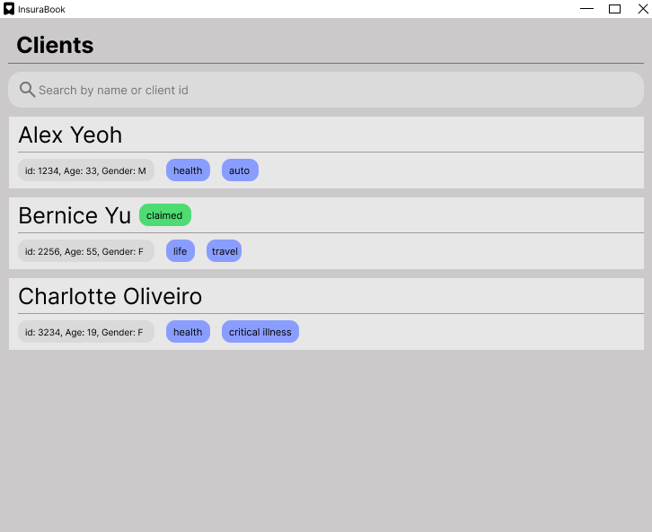

# InsuraBook
> Your clients, your policies, all in one book.
---

## About - InsuraBook
* The project simulates an ongoing software project for a multi-platform application (called _InsuraBook_) used by
* Insurance Agents for managing client details.
  * It is **written in OOP fashion**. It provides a **reasonably well-written** code base **bigger** (around 6 KLoC)
  * than what students usually write in beginner-level SE modules, without being overwhelmingly big.
  * It comes with a **reasonable level of user and developer documentation**.

This project is based on the AddressBook-Level3 project created by the [SE-EDU initiative](https://se-education.org).
