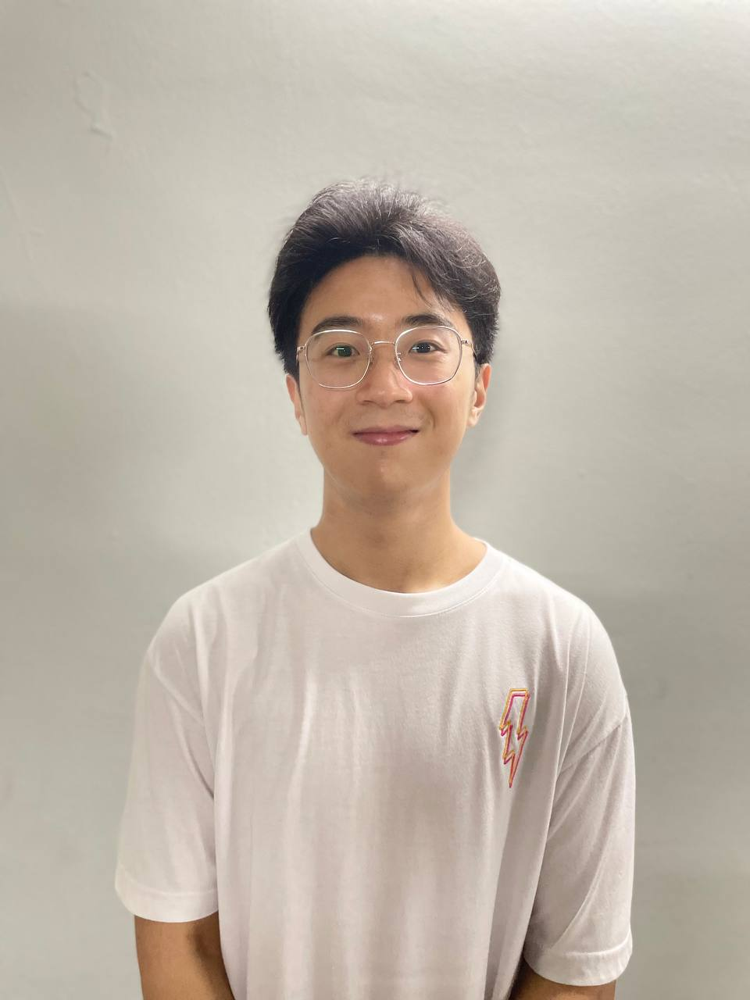
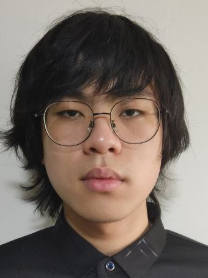

We are a team based in the [School of Computing, National University of Singapore](https://www.comp.nus.edu.sg).

You can reach us at the email `seer[at]comp.nus.edu.sg`

## Project team
[[homepage](https://nus-cs2103-ay2526s1.github.io/tp/)]

### Kevin Tan

[[github](https://github.com/kevintanjc)]
[[portfolio](team/kevin.md)]

* Role: Software Engineer
* Responsibilities: Backend + Testing

### Jane Doe

[[github](http://github.com/johndoe)]
[[portfolio](team/johndoe.md)]

* Role: Team Lead
* Responsibilities: UI

### Tan Jay

[[github](http://github.com/jayyyyy25)] [[portfolio](team/jayyyyy25.md)]

* Role: Developer

### Jun Yan

[[github](http://github.com/junyan-k)]
[[portfolio](team/junyan-k.md)]

* Role: Developer

### Zi Yong

[[github](http://github.com/yong0112)]
[[portfolio](team/ziyong.md)]

* Role: Developer
