## Table of Contents

- [Acknowledgements](#acknowledgements)
- [Setting up, getting started](#setting-up-getting-started)
- [Design](#design)
  - [Architecture](#architecture)
  - [UI component](#ui-component)
  - [Logic component](#logic-component)
  - [Model component](#model-component)
  - [Storage component](#storage-component)
  - [Common classes](#common-classes)
- [Implementation](#implementation)
  - [Storage Component](#storage-component-1)
  - [Design Considerations](#design-considerations)
- [Documentation, logging, testing, configuration, dev-ops](#documentation-logging-testing-configuration-dev-ops)
- [Appendix: Requirements](#appendix-requirements)
  - [Product scope](#product-scope)
  - [User stories](#user-stories)
  - [Use cases](#use-cases)
  - [Non-Functional Requirements](#non-functional-requirements)
  - [Glossary](#glossary)
- [Appendix: Instructions for manual testing](#appendix-instructions-for-manual-testing)
  - [Launch and shutdown](#launch-and-shutdown)
  - [Adding a client](#adding-a-client)
  - [Deleting a client](#deleting-a-client)
  - [Editing a client](#editing-a-client)
  - [Finding a client](#finding-a-client)
  - [Viewing clients or policy\'s types](#viewing-clients-or-policys-types)
  - [Viewing policies of a client](#viewing-policies-of-a-client)
  - [Saving data](#saving-data)
--------------------------------------------------------------------------------------------------------------------

## **Acknowledgements**

- Sources and inspiration:
  - SE-EDU AddressBook and guides: https://github.com/se-edu/addressbook-level3 and https://se-education.org/guides
  - PlantUML tutorial and examples: https://plantuml.com and https://se-education.org/guides/tutorials/plantUml.html
  - Design styling and colour scheme: https://github.com/tokyo-night/tokyo-night-vscode-theme
- Libraries and tools used (include links to original projects):
  - JavaFX: https://openjfx.io
  - Jackson (JSON): https://github.com/FasterXML/jackson
  - JUnit 5 (testing): https://junit.org/junit5/
  - Gradle (build): https://gradle.org
  - Bundler (Ruby dependency manager): https://bundler.io
  - IntelliJ IDEA (IDE): https://www.jetbrains.com/idea/
- Third-party code and licenses:
  - Any reused or adapted code from the above projects is used under the respective project licenses;
consult the original repositories for full license details.

--------------------------------------------------------------------------------------------------------------------

## **Setting up, getting started**

Refer to the guide [_Setting up and getting started_](SettingUp.md).

--------------------------------------------------------------------------------------------------------------------

## **Design**

:bulb: **Tip:** The `.puml` files used to create diagrams are in this document `docs/diagrams` folder. Refer to the [_PlantUML Tutorial_ at se-edu/guides](https://se-education.org/guides/tutorials/plantUml.html) to learn how to create and edit diagrams.

### Architecture

    

The ***Architecture Diagram*** given above explains the high-level design of the App.

Given below is a quick overview of main components and how they interact with each other.

**Main components of the architecture**

**`Main`** (consisting of classes [`Main`](https://github.com/AY2526S1-CS2103T-F15b-1/tp/blob/master/src/main/java/insurabook/Main.java) and [`MainApp`](https://github.com/AY2526S1-CS2103T-F15b-1/tp/blob/master/src/main/java/insurabook/MainApp.java)) and is in charge of the app launching and shutting
down.
* At app launch, it initializes the other components in the correct sequence, and connects them up with each other.
* At shut down, it shuts down the other components and invokes cleanup methods where necessary.

The bulk of the app's work is done by the following four components:

* [**`UI`**](#ui-component): The UI of the App.
* [**`Logic`**](#logic-component): The command executor.
* [**`Model`**](#model-component): Holds the data of the App in memory.
* [**`Storage`**](#storage-component): Reads data from, and writes data to, the hard disk.

[**`Commons`**](#common-classes) represents a collection of classes used by multiple other components.

**How the architecture components interact with each other**

The *Sequence Diagram* below shows how the components interact with each other for the scenario where the user issues
the command `delete -c_id C101`.

    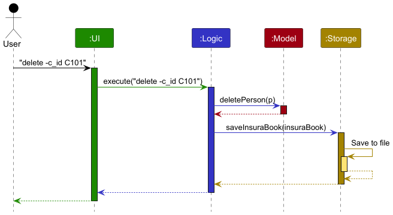

Each of the four main components (also shown in the diagram above),

* defines its *API* in an `interface` with the same name as the Component.
* implements its functionality using a concrete `{Component Name}Manager` class (which follows the corresponding API `interface` mentioned in the previous point.

For example, the `Logic` component defines its API in the `Logic.java` interface and implements its functionality using the `LogicManager.java` class which follows the `Logic` interface. Other components interact with a given component through its interface rather than the concrete class (reason: to prevent outside component's being coupled to the implementation of a component), as illustrated in the (partial) class diagram below.

    

The sections below give more details of each component.

### UI component

The **API** of this component is specified in [`Ui.java`](https://github.com/AY2526S1-CS2103T-F15b-1/tp/blob/master/src/main/java/insurabook/ui/Ui.java)

    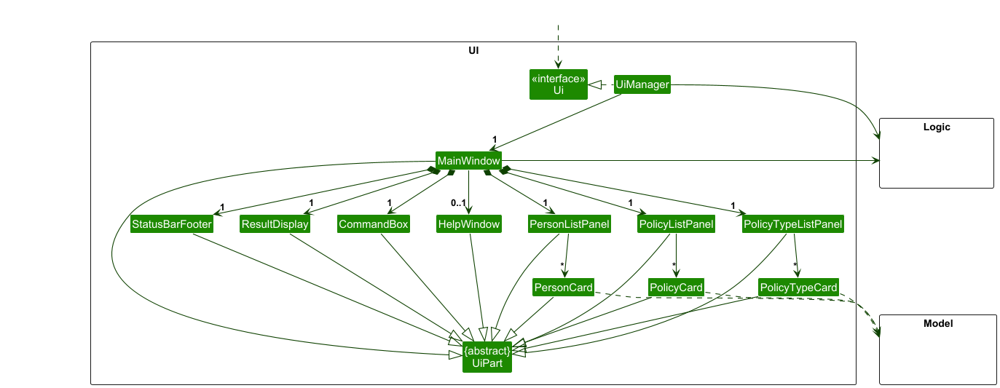

The UI consists of a `MainWindow` that is made up of parts e.g.`CommandBox`, `ResultDisplay`, `PersonListPanel`,
`StatusBarFooter`, `HelpWindow`, `PolicyListPanel`, `PolicyTypeListPanel` etc. All these, including the `MainWindow`,
inherit from the abstract `UiPart` class which captures the commonalities between classes that represent parts of the
visible GUI.

The `UI` component uses the JavaFx UI framework. The layout of these UI parts are defined in matching `.fxml` files
that are in the `src/main/resources/view` folder. For example, the layout of the
[`MainWindow`](https://github.com/AY2526S1-CS2103T-F15b-1/tp/blob/master/src/main/java/insurabook/ui/MainWindow.java)
is specified in [`MainWindow.fxml`](https://github.com/AY2526S1-CS2103T-F15b-1/tp/blob/master/src/main/resources/view/MainWindow.fxml)

The `UI` component,

* executes user commands using the `Logic` component.
* listens for changes to `Model` data so that the UI can be updated with the modified data.
* keeps a reference to the `Logic` component, because the `UI` relies on the `Logic` to execute commands.
* depends on some classes in the `Model` component, as it displays `Client` object residing in the `Model`.

### Logic component

**API** : [`Logic.java`](https://github.com/AY2526S1-CS2103T-F15b-1/tp/blob/master/src/main/java/insurabook/logic/Logic.java)

Here's a (partial) class diagram of the `Logic` component:

    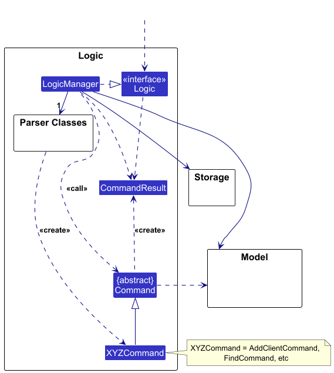

The sequence diagram below illustrates the interactions within the `Logic` component, taking
`execute("delete -c_id C101")` API call as an example.

    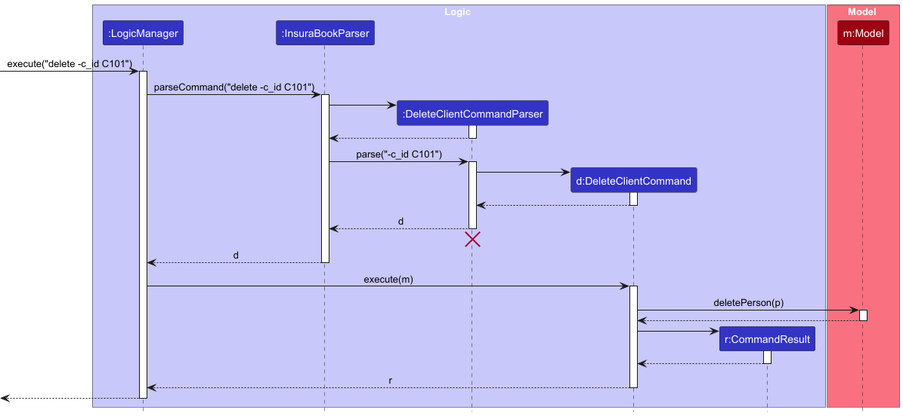

:information_source: **Note:** The lifeline for
`DeleteClientCommandParser` should end at the destroy marker (X) but due to a limitation of PlantUML, the lifeline continues till the end of diagram.

How the `Logic` component works:

1. When `Logic` is called upon to execute a command, it is passed to an `InsuraBookParser` object which in turn creates
2. a parser that matches the command (e.g., `DeleteClientCommandParser`) and uses it to parse the command.
1. This results in a `Command` object (more precisely, an object of one of its subclasses e.g., `DeleteClientCommand`)
2. which is executed by the `LogicManager`.
1. The command can communicate with the `Model` when it is executed (e.g. to delete a client). 
   Note that although this is shown as a single step in the diagram above (for simplicity), in the code it can take several interactions (between the command object and the `Model`) to achieve.
1. The result of the command execution is encapsulated as a `CommandResult` object which is returned back from `Logic`.

Here are the other classes in `Logic` (omitted from the class diagram above) that are used for parsing a user command:

    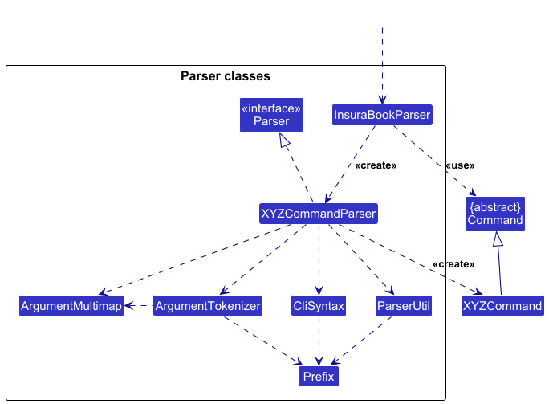

How the parsing works:
* When called upon to parse a user command, the `InsuraBookParser` class creates an `XYZCommandParser` (`XYZ` is a
placeholder for the specific command name e.g., `AddClientCommandParser`) which uses the other classes shown above to
parse the user command and create a `XYZCommand` object (e.g., `AddClientCommand`) which the `InsuraBookParser`
returns back as a `Command` object.
* All `XYZCommandParser` classes (e.g., `AddClientCommandParser`, `DeleteClientCommandParser`, ...) inherit from
the `Parser` interface so that they can be treated similarly where possible e.g, during testing.

### Model component
**API** : [`Model.java`](https://github.com/AY2526S1-CS2103T-F15b-1/tp/blob/master/src/main/java/insurabook/model/Model.java)

    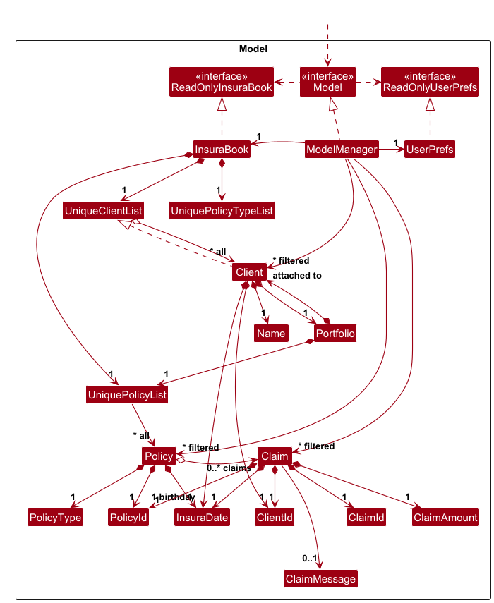

The `Model` component,

* stores the InsuraBook data i.e., all `Client` objects (which are contained in a `UniqueClientList` object).
* stores the currently 'selected' `Client` objects (e.g., results of a search query) as a separate _filtered_ list
which is exposed to outsiders as an unmodifiable `ObservableList<Client>` that can be 'observed' e.g. the UI can be
bound to this list so that the UI automatically updates when the data in the list change.
* stores a `UserPref` object that represents the user’s preferences. This is exposed to the outside as a
`ReadOnlyUserPref` objects.
* does not depend on any of the other three components (as the `Model` represents data entities of the domain, they
should make sense on their own without depending on other components)

### Storage component

**API** : [`Storage.java`](https://github.com/AY2526S1-CS2103T-F15b-1/tp/blob/master/src/main/java/insurabook/storage/Storage.java)

    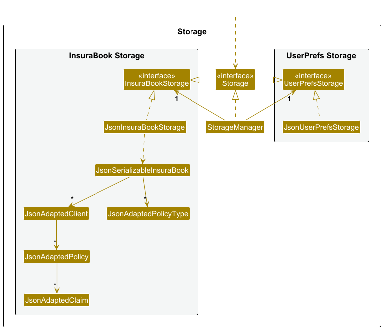

The `Storage` component,
* can save both InsuraBook data and user preference data in JSON format, and read them back into corresponding objects.
* inherits from both `InsuraBookStorage` and `UserPrefStorage`, which means it can be treated as either one (if only
the functionality of only one is needed).
* depends on some classes in the `Model` component (because the `Storage` component's job is to save/retrieve objects
that belong to the `Model`)

### Common classes

Classes used by multiple components are in the `insurabook.commons` package.

--------------------------------------------------------------------------------------------------------------------

## **Implementation**

This section describes some noteworthy details on how certain features are implemented.

### Storage Component

#### Purpose and Overview
The Storage component is responsible for all read/write operations on the user's hard drive. It handles the storage of
both the InsuraBook data and user preferences in JSON format. The component ensures that data is correctly serialized
and deserialized when saving to or loading from disk between application sessions.

All data is stored in a single JSON file named `insurabook.json`, typically located at `data/insurabook.json` within
the home directory.

#### Architecture Design
Our `Model` classes (like `Client`, `Policy`, etc.) are too complex and designed to be independent of the storage
format, which are not suitable for direct JSON serialization.

To solve this, we introduce a parallel set of simple "adapter" classes (e.g., `JsonAdaptedClient`, `JsonAdaptedPolicy`,
etc.). These classes act as intermediaries between the `Model` classes and the JSON format.

**Key Classes:**
* `Storage`: An interface that defines the high-level methods `readInsurabook()` and `saveInsurabook()`. The rest of
the application (e.g., `LogicManager`) only depends on this interface.

* `StorageManager`: The main concrete implementation of `Storage`. It delegates its tasks to `JsonInsurabookStorage`.

* `JsonInsurabookStorage`: This class directly handles the serialization/deserialization of data to and from the JSON
file. It uses the Jackson JSON library.

* `JsonSerializableInsurabook`: A helper class that represents the top-level JSON object (e.g., containing a
`List<JsonAdaptedClient>`).

* `JsonAdaptedClient`: `Client`'s adapter class. It has simple `String` and `List` fields (like `name`, `c_id`,
`policies`). It is responsible for converting a `Client` object to a JSON-friendly format and vice versa.

* `JsonAdaptedPolicyType`: `PolicyType`'s adapter class for the `PolicyType` object.

* `JsonAdaptedPolicy`: `Policy`'s adapter class for the `Policy` object.

* `JsonAdaptedClaim`: `Claim`'s adapter class for the `Claim` object.

#### Data Flow
1. **Saving Data:**
   - This sequence is triggered every time a command that modifies data (like `AddCommand`, `DeleteCommand`, etc.) is
   successfully executed.

    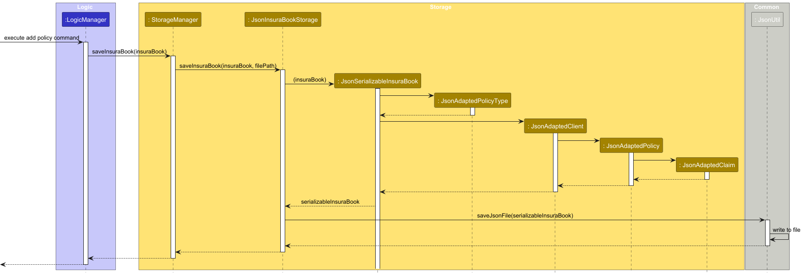

   - Constructor for JsonSerializableInsuraBook:

    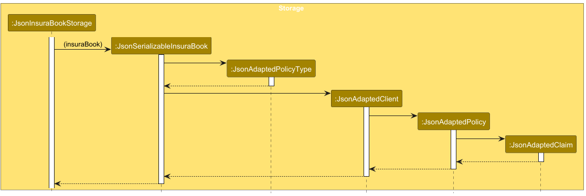

2. **Loading Data:**
   - This sequence occurs during application startup when the InsuraBook data is loaded from disk.

    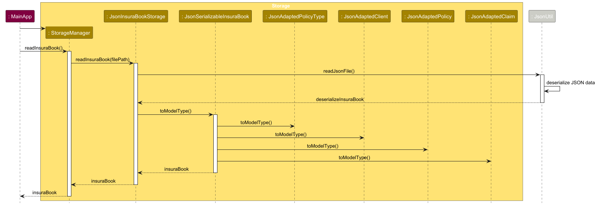

   - Converting JsonSerializableInsuraBook to a Model:

    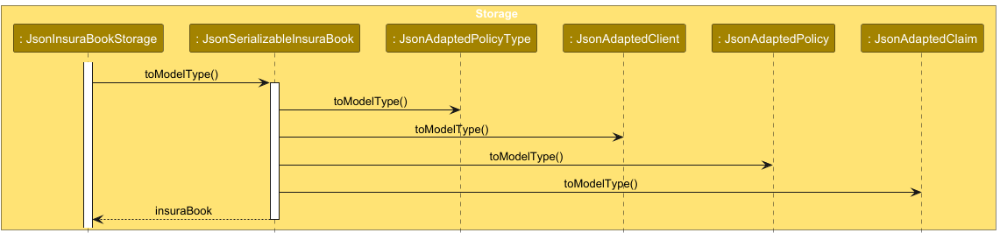

#### Handling Data Corruption
It is possible that the JSON file on disk may become corrupted or contain invalid data. If the JSON file is malformed,
Jackson will throw a `JsonParseException` during deserialization. If the JSON structure is valid but fails our
internal data validation (e.g., missing required fields, invalid values), we throw an `IllegalValueException`.

To handle this, the `StorageManager` catches these exceptions and wraps them in a `DataLoadingException`, which is then
1. Log the error details for debugging purposes.
2. Move the corrupted file to a backup location (e.g., `data/insurabook_backup_TIMESTAMP.json`) to prevent further issues.
3. Initialize a new empty InsuraBook data file to allow the application to continue functioning.

**Result:** The user sees a warning, and the application starts with a clean slate, as if it's the first launch.
Their corrupted data is not lost, but saved in the backup file for manual inspection.

#### Design Considerations
**Aspect: How to map in-memory Model objects into JSON file?**
Converting complex Model objects directly to JSON can be challenging due to their intricate relationships and data
types, which may not be directly serializable.

**Alternative 1 (current choice): Use adapter classes**
* **Description:** This approach involves creating a set of "adapter" classes (e.g., `JsonAdaptedClient`,
`JsonAdaptedPolicy`) that are simple POJOs (Plain Old Java Objects). The `StorageManager` is responsible for converting
the complex `Model` objects, which contain JavaFX properties, into these simple adapter objects before serialization.
Conversely, it converts the adapter objects back into `Model` objects (running validation) after deserialization.
* **Pros:**
  * **Strong Decoupling:** Decouples the storage format from the Model classes (e.g. `Client`, `Policy`), so they can
  freely use complex JavaFX properties without breaking serialization, allowing both to evolve independently.
  * **Centralized Validation:** Provides a clear and robust location for data validation. The `toModelType()` method in
  each adapter class is the perfect place to check for invalid data (e.g., missing IDs, invalid date formats) before
  the real model objects are created.
  * **Resilience to Changes:** If the Model classes change (e.g., adding new fields), we only need to update the adapter
  classes and the conversion logic in `StorageManager`, rather than modifying the Model classes themselves.
* **Cons:**
  * **Increased Complexity:** Introduces additional classes and conversion logic, which adds some complexity  to the
  codebase and adds one more layer of abstraction.

**Alternative 2: Direct Serialization**
* **Description:** This approach would involve making the `Model` classes (e.g., `Client`, `Policy`) directly
serializable to JSON by adding Jackson annotations or implementing custom serializers/deserializers.
* **Pros:**
  * **Simplicity:** Fewer classes to manage, as there are no adapter classes. The serialization logic is contained
  within the Model classes themselves.
* **Cons:**
* **Tight Coupling:** Couples the `Model` classes to the storage format. The `Model` classes would need to be aware of
serialization concerns, which can clutter their design, making it harder to change one without affecting the other.
* **Limited Flexibility:** Complex `Model` classes with JavaFX properties may not serialize cleanly, leading to
potential data loss or corruption.
* **Scattered Validation:** Data validation logic would be scattered across multiple Model classes, making it harder
to maintain and ensure consistency.

We chose **Alternative 1** because the benefits of decoupling and robust validation are critical for this application.
The `Model` must remain independent of storage to allow flexibility. While Alternative 1 requires more setup, it makes
the entire application safer, more maintainable, and less prone to errors from corrupted data or future refactoring.

--------------------------------------------------------------------------------------------------------------------

## **Documentation, logging, testing, configuration, dev-ops**

* [Documentation guide](Documentation.md)
* [Testing guide](Testing.md)
* [Logging guide](Logging.md)
* [Configuration guide](Configuration.md)
* [DevOps guide](DevOps.md)

--------------------------------------------------------------------------------------------------------------------

## **Appendix: Requirements**

### Product scope

**Target user profile**:

* Insurance agent who has a need to manage a significant number of clients
* can type fast
* is reasonably comfortable using CLI apps

**Value proposition**:

* Allows easier tracking of clients, policies, and claims
* Performs operations on clients data quickly through CLI
* Helps agents stay on top of tasks with automated reminders for client birthdays and expiring policies.

### User stories

Priorities: High (must have) - `* * *`, Medium (nice to have) - `* *`, Low (unlikely to have) - `*`

| Priority | As a …​                         | I want to …​                                                | So that I can…​                                                          |
|----------|---------------------------------|-------------------------------------------------------------|--------------------------------------------------------------------------|
| `* * *`  | insurance agent                 | add clients to the app                                      | start tracking their policies and claims                                 |
| `* * *`  | insurance agent                 | edit client's information                                   | update client details as needed                                          |
| `* * *`  | insurance agent                 | delete clients from the app                                 | remove records for clients I no longer manage                            |
| `* * *`  | insurance agent                 | add a new policy type (product) to the system               | define the insurance products I offer before selling them.               |
| `* * *`  | insurance agent                 | edit an existing policy type's details                      | correct or update my product catalog                                     |
| `* * *`  | insurance agent                 | delete a policy type                                        | remove products I no longer offer                                        |
| `* * *`  | insurance agent                 | see the expiry date and details (type) of a client’s policy | address client concerns quickly when asked                               |
| `* * *`  | insurance agent                 | add policies to a client’s profile                          | keep track of the latest policies my clients are covered under           |
| `* * *`  | insurance agent                 | edit an existing policy's expiry date                       | update a policy that has been renewed or corrected                       |
| `* * *`  | insurance agent                 | delete policies from a client’s profile                     | ensure only the latest policies my clients are covered under are tracked |
| `* * *`  | insurance agent                 | add claims to a client’s profile                            | keep track of new claims as they come in                                 |
| `* * *`  | insurance agent                 | edit an existing claim's details                            | update claim details as needed                                           |
| `* * *`  | insurance agent                 | delete claims from a client’s profile                       | remove resolved or incorrect claims so the records stay accurate         |
| `* * *`  | insurance agent                 | search for a client by name or policy number                | locate a client easily and find the information I needed                 |
| `* * *`  | insurance agent                 | view the app through a client view or a policy view         | directly look at policies or clients                                     |
| `* *`    | insurance agent                 | receive reminders for upcoming policy expirations           | proactively reach out to clients to renew their policies                 |
| `* *`    | insurance agent                 | receive reminders for client birthdays                      | maintain good client relationships by acknowledging their birthdays      |
| `* *`    | insurance agent                 | undo my last action that changed data                       | quickly revert a mistake                                                 |
| `* * *`  | first-time insurance agent user | easily launch the app                                       | start saving client details without much unnecessary procedures          |

### Use cases

(For all use cases below, the **System** is the `InsuraBook` and the **Actor** is the `user`, unless specified otherwise)

#### Use case 1: Add a new client

**MSS**

1. User requests to view all clients.
2. InsuraBook shows the list of clients.
3. User requests to add a new client with all the required details.
4. InsuraBook shows the updated list of clients with the new client added.

    Use case ends.

**Extensions**
* 3a. User requests to add a client with client ID that already exists.

  * 3a1. InsuraBook shows an error message that client already exists.

  Use case ends.

* 3b. User requests to add a client with insufficient details.

  * 3b1. InsuraBook shows an error message that mentions invalid command format.
  * 3b2. User requests to add a new client with new details.
  * 3b3. Steps 3b1 - 3b2 are repeated until user provides all correct details.
  * Use case resumes at step 4.

#### Use case 2: Add a new policy type

**MSS**
1.  User requests to view types of policy.
2.  InsuraBook shows a list of policy types.
3.  User requests to add a new policy type with all the required details.
4.  InsuraBook shows the updated list of policy types with the new policy type added.

    Use case ends.

**Extensions**

* 3a. User requests to add a policy type that already exists.

  * 3a1. InsuraBook shows an error message that policy type already exists.

  Use case ends.

* 3b. User requests to add a policy type with insufficient details.

  * 3b1. InsuraBook shows an error message that mentions invalid command format.
  * 3b2. User requests to add a new policy type with all the required details.
  * 3b3. Steps 3b1 - 3b2 are repeated until user provides all correct details.
  * Use case resumes at step 4.

* 3c. User requests to add a policy type with invalid entries.

  * 3c1. InsuraBook shows an error message that mentions invalid entries.
  * 3c2. User requests to add a new policy type with all the required details.
  * 3c3. Steps 3c1 - 3c2 are repeated until user provides all correct details.
  * Use case resumes at step 4.

#### Use case 3: Add a new policy for a client

**MSS**

1.  User requests to view types of policy.
2.  InsuraBook shows a list of policy types.
3.  User requests to view a specific client.
4.  InsuraBook shows the specific client profile.
5.  User requests to add a policy to the client.
6.  InsuraBook adds a policy to a client's profile.
7.  User requests to view client's profile.
8.  InsuraBook shows the client profile with the updated list of policies.

    Use case ends.

**Extensions**

* 4a. Specific client does not exist.

  * 4a1. InsuraBook shows an error message that client does not exist.
  * 4a2. User requests to add a new client with all the required details.
  * 4a3. InsuraBook shows the updated list of clients with the new client added. 
  * Use case resumes at step 5.

* 6a. Policy type does not exist.

  * 6a1. InsuraBook shows an error message that no such policy type exists.
  * 6a2. User requests to add a new policy type with all the required details.
  * Steps 6a1 - 6a2 are repeated until user provides all correct details for policy type.
  * Use case resumes at step 5.

* 6b. Invalid expiration date format provided.

  * 6b1. InsuraBook shows an error message that mentions invalid date format.
  * 6b2. User requests to add a policy to the client with a valid expiration date.
  * Steps 6b1 - 6b2 are repeated until user provides a valid expiration date.
  * 6b3. InsuraBook adds a policy to a client's profile.
  * Use case resumes at step 7.

* 6c. Provided expiration date is before today.

  * 6c1. InsuraBook shows an error message that mentions invalid date.
  * 6c2. User requests to add a policy to the client with a valid expiration date.
  * Steps 6c1 - 6c2 are repeated until user provides a valid expiration date.
  * 6c3. InsuraBook adds a policy to a client's profile.
  * Use case resumes at step 7.

* 6d. Client already has the specified policy.

  * 6d1. InsuraBook shows an error message that mentions duplicate policy.

  Use case ends.

#### Use case 4: Add a new claim on a policy

**MSS**

1.  User requests to search for all policies under a specific client.
2.  InsuraBook shows all policies on the client profile.
3.  User looks through the policies and selects a specific policy.
4.  User adds a claim to a specific policy.
5.  InsuraBook shows the specific policy on the client profile with the claim.

    Use case ends.

**Extensions**

* 2a. Specified client ID does not exist.

  * 2a1. InsuraBook shows an error message that client does not exist.
  * 2a2. User requests to search for all clients.
  * 2a3. InsuraBook shows all clients.
  * 2a4. User requests to view a specific client with the correct client ID.
  * Use case resumes at step 2.

* 3a. Specified client does not have the required policy.

  * 3a1. User requests to add a policy to the client with valid fields.
  * 3a2. InsuraBook adds a policy to a client's profile.
  * Use case resumes at step 4.

* 5a. Claim is a duplicate of an existing claim

  * 5a1. InsuraBook shows an error message that claim already exists.

  Use case ends.

* 5b. Invalid claim date format provided.

  * 5b1. InsuraBook shows an error message that claim date has invalid format.
  * 5b2. User requests to add a claim to the specific policy with a valid claim date.
  * Steps 5b1 - 5b2 are repeated until user provides a valid claim date.
  * 5b3. InsuraBook shows the specific policy on the client profile with the claim.

  Use case ends.

* 5c. Provided claim date is after policy expiration date.

  * 5c1. InsuraBook shows an error message that claim date is after policy expiration date.
  * 5c2. User requests to add a claim to the specific policy with a valid claim date.
  * Steps 5c1 - 5c2 are repeated until user provides a valid claim date.
  * 5c3. InsuraBook shows the specific policy on the client profile with the claim.

  Use case ends.

#### Use case 5: Delete a client

**MSS**

1.  User requests to view all clients.
2.  InsuraBook shows the list of clients.
3.  User requests to delete a specific client.
4.  InsuraBook shows the updated list of clients with the specific client removed.

    Use case ends.

**Extensions**

* 3a. User requests to delete client by name.

    * 3a1. InsuraBook shows an error message that mentions invalid command format.
    * 3a2. User requests to delete a specific client by client ID.
    * Use case resumes at step 4.

* 3b. User requests to delete client with non-existing client ID.

    * 3b1. InsuraBook shows an error message that no such client exists.

    Use case ends.

#### Use case 6: Delete a policy type

**MSS**
1.  User requests to view types of policy.
2.  InsuraBook shows a list of policy types.
3.  User requests to delete an existing policy type with all the required details.
4.  InsuraBook shows the updated list of policy types with the policy type deleted.

    Use case ends.

**Extensions**

* 3a. User requests to delete a policy type that does not exist.

    * 3a1. InsuraBook shows an error message that policy type could not be found.

  Use case ends.

#### Use case 7: Delete a policy from a client

**MSS**

1.  User requests to view all clients.
2.  InsuraBook shows the list of clients.
3.  User requests to view a specific client.
4.  InsuraBook shows the specific client profile.
5.  User requests to delete a specific policy from the client.
6.  InsuraBook shows the client profile with the updated list of policies.

    Use case ends.

**Extensions**

* 5a. User requests to delete a policy that does not exist on the client.

    * 5a1. InsuraBook shows an error message that policy could not be found.

  Use case ends.

* 5b. User requests to delete a policy but does not specify which policy to delete.

    * 5b1. InsuraBook shows an error message that mentions invalid command format.
    * 5b2. User requests to delete a specific policy that exist from the client.
    * Use case resumes at step 6.

* 5c. User requests to delete a policy from a client that does not exist.

    * 5c1. InsuraBook shows an error message that client could not be found.

  Use case ends.

#### Use case 8: Delete a claim from a policy

**MSS**

1.  User requests to view all clients.
2.  InsuraBook shows the list of clients.
3.  User requests to view a specific client.
4.  InsuraBook shows all policies and claims relating to specific client.
5.  User requests to delete a specific claim from a specific policy.
6.  InsuraBook shows the specific policy on the client profile with the updated list of claims.

    Use case ends.

**Extensions**

* 5a. User requests to delete a claim that does not exist on the policy.

    * 5a1. InsuraBook shows an error message that claim could not be found.

  Use case ends.

* 5b. User requests to delete a claim but does not specify which claim to delete.

    * 5b1. InsuraBook shows an error message that mentions invalid command format.
    * 5b2. User requests to delete a specific valid claim that exist from the policy.
    * Use case resumes at step 6.

* 5c. User requests to delete a claim from a policy that does not exist.

    * 5c1. InsuraBook shows an error message that policy could not be found.

  Use case ends.

#### Use case 9: Edit a client

**MSS**

1.  User requests to view all clients.
2.  InsuraBook shows the list of clients.
3.  User requests to edit a specific client, specifying the fields they wish to change.
4.  InsuraBook shows the updated list of clients with the newly edited client.

    Use case ends.

**Extensions**
* 3a. User requests to edit a client that does not exist.

    * 3a1. InsuraBook shows an error message that client could not be found.

  Use case ends.

* 3b. User requests to edit a client but does not specify any fields to change.

    * 3b1. InsuraBook shows an error message that at least one field to change is needed.
    * 3b2. User requests to edit a specific client, specifying the fields they wish to change.
    * Use case resumes at step 4.

#### Use case 10: Edit a policy type

**MSS**
1.  User requests to view types of policy.
2.  InsuraBook shows a list of policy types.
3.  User requests to edit a policy type, specifying the fields they wish to change.
4.  InsuraBook shows the updated list of policy types with the newly edited policy type.

    Use case ends.

**Extensions**

* 3a. User requests to edit a policy type that does not exist.

    * 3a1. InsuraBook shows an error message that policy type could not be found.

  Use case ends.

* 3b. User requests to edit a policy type but does not specify any fields to change.

    * 3b1. InsuraBook shows an error message that at least one field to change is needed.

  Use case ends.

* 3c. User requests to change the policy type's name to one that already exists.

    * 3c1. InsuraBook shows an error message that this operation would result in a duplicate policy type.

  Use case ends.

* 3d. User requests to change a policy type's field to an invalid value.

    * 3d1. InsuraBook shows an error message specifying which field has an invalid value and what values are valid.

  Use case ends.

#### Use case 11: Edit a policy from a client

**MSS**

1.  User requests to view all clients.
2.  InsuraBook shows the list of clients.
3.  User requests to view a specific client.
4.  InsuraBook shows the specific client profile.
5.  User requests to edit the expiration date of a specific policy from the client.
6.  InsuraBook shows the client profile with the updated policy.

    Use case ends.

**Extensions**

* 5a. User requests to edit a policy that does not exist on the client.

    * 5a1. InsuraBook shows an error message that policy could not be found.

  Use case ends.

* 5b. User requests to edit a policy but does not specify which policy to edit.

    * 5b1. InsuraBook shows an error message that mentions invalid command format.
    * 5b2. User requests to edit a specific policy that exist from the client.
    * Use case resumes at step 6.

* 5c. User requests to edit a policy but does not specify policy expiration date.

    * 5c1. InsuraBook shows an error message that mentions expiry date must be provided.
    * 5c2. User requests to edit a specific policy with a valid expiration date.
    * Steps 5c1 - 5c2 are repeated until user provides a valid expiration date.
    * Use case resumes at step 6.

#### Use case 12: Edit a claim from a policy

**MSS**

1.  User requests to view all clients.
2.  InsuraBook shows the list of clients.
3.  User requests to view the policies and claims of a specific client.
4.  InsuraBook shows all policies and claims relating to specific client.
5.  User requests to edit a specific claim from a specific policy.
6.  InsuraBook shows the specific policy on the client profile with the updated claim.

    Use case ends.

**Extensions**

* 5a. User requests to edit a claim that does not exist on the policy.

    * 5a1. InsuraBook shows an error message that claim could not be found.

  Use case ends.

* 5b. User requests to edit a claim for a client that does not exist.

    * 5b1. InsuraBook shows an error message that mentions client does not exist.
    * 5b2. User requests to edit a specific valid claim that exist for a client that exist.
    * Use case resumes at step 6.

* 5c. User requests to edit a claim but does not specify which claim to edit.

    * 5c1. InsuraBook shows an error message that mentions invalid command format.
    * 5c2. User requests to edit a specific valid claim that exist from the policy.
    * Use case resumes at step 6.

#### Use case 13: Search for a client

**MSS**

1.  User requests to search for a client by name or client ID.
2.  InsuraBook shows the list of clients that match the search criteria.

    Use case ends.

**Extensions**

* 1a. No clients match the search criteria.

    * 1a1. InsuraBook shows an empty list.

  Use case ends.

* 1b. User requests to search for a client on policy screen.

    * 1b1. InsuraBook switches to client view.
    * 1b2. InsuraBook shows the list of clients that match the search criteria.

  Use case ends.

#### Use case 14: View app in policy view

**MSS**

1.  User requests to switch to policy view.
2.  InsuraBook shows the list of policies types.

    Use case ends.

**Extensions**

* 1a. User is already in policy view.

    * 1a1. InsuraBook continues to show the list of policy types.

  Use case ends.

* 1b. No policy types exist.

    * 1b1. InsuraBook shows an empty list.

  Use case ends.

#### Use case 15: View app in client view

**MSS**

1.  User requests to switch to client view.
2.  InsuraBook shows the list of clients.

    Use case ends.

**Extensions**

* 1a. User is already in client view.

    * 1a1. InsuraBook continues to show the list of clients.

  Use case ends.

* 1b. No clients exist.

    * 1b1. InsuraBook shows an empty list.

  Use case ends.

#### Use case 16: View client's claims and policies

**MSS**

1.  User requests to switch to client portfolio view.
2.  InsuraBook shows the list of policies and claims that the specified client has.

    Use case ends.

**Extensions**

* 1a. User is already in specified client portfolio view.

    * 1a1. InsuraBook continues to show the list of policies and claims that the specified client has.

  Use case ends.

* 1b. Client specified has no policies and hence claims.

    * 1b1. InsuraBook shows an empty list.

  Use case ends.

#### Use case 17: Undo last action

**MSS**

**Extentions**

### Non-Functional Requirements

1.  Should work on any _mainstream OS_ as long as it has Java `17` or above installed.
2.  Should be able to hold up to 1000 clients without a noticeable sluggishness in performance for typical usage.
3.  Should be able to hold up to 10000 policies without a noticeable sluggishness in performance for typical usage.
4.  A user with above average typing speed for regular English text (i.e. not code, not system admin commands) should be able to accomplish most of the tasks faster using commands than using the mouse.
5.  Should work without additional libraries
6.  Should work locally on user's device
7.  Should work without an installer

### Glossary

* **Mainstream OS**: Windows, Linux, Unix, macOS
* **Client**: An individual client of the user. If a group is under the same policy (e.g. family protection), each member of the group is a different Client.
* **Policy Type**: A specific policy/plan offered by the user/the user's firm. This is different from a Policy.
* **Policy**: An instance of a Policy Type owned by a Client. This is different from a Policy Type.
* **Claim**: Produced by a Client in regard to one of their Policies.

--------------------------------------------------------------------------------------------------------------------

## **Appendix: Instructions for manual testing**

Given below are instructions to test the app manually.

:information_source: **Note:** These instructions only provide a starting point for testers to work on;
testers are expected to do more *exploratory* testing.

### Launch and shutdown

1. Initial launch

   * Download the jar file and copy into an empty folder.

   * Open a command terminal in the folder and run `java -jar insurabook.jar`.

   * **Expected:** Shows the GUI with a set of sample contacts. The window size may not be optimum.

2. Saving window preferences

   * Resize the window to an optimum size. Move the window to a different location. Close the window.

   * Re-launch the app by double-clicking the jar file. 

   * **Expected:** The most recent window size and location is retained.

### Adding a client
1. Adding a client with all fields specified
    * Test cases: `add -n John Doe -phone 98765432 -email johndoe@gmail.com -b 1970-01-01 -c_id C101`
    * **Expected:** Client "John Doe" is added to the client list with his information. Success message is shown in the
   result display.

2. Adding a client with missing required fields
    * Test cases: `add -n John Doe -phone 98765432 -b 1970-01-01 -c_id C101` (missing email field)
    * **Expected:** Error message indicating invalid command format is shown in the result display, together with its
   correct command usage.

3. Adding a client with invalid field values
    * Test cases: `add -n John Doe -phone 98765432 -email johndoe123 -b 1970-01-01 -c_id C101` (invalid email field)
    * **Expected:** Error message indicating the email format is invalid is shown in the result display.

4. Adding a duplicate client
    * Test cases: Add a client "John Doe" as in test case 1. Then, repeat the same command to add "John Doe" again.
    * **Expected:** Error message indicating that a client already exists is shown in the result display.

### Adding a policy type
1. Adding a policy type with all fields specified
    * Test cases: `add policy type -pt_id P101 -pt_n Policy 101 -desc Description of Policy 101 -premium 1000`
    * **Expected:** Policy Type "Policy 101" is added to the policy type list. Success message is shown in the
   result display.

2. Adding a policy type with some optional fields specified
    * Test cases: `add policy type -pt_id P102 -pt_n Policy 102 -desc Description of Policy 102`
    * **Expected:** Policy Type "Policy 102" is added to the policy type list, which has a description but no premium.
   Success message is shown in the result display.

3. Adding a policy type with only mandatory fields specified
    * Test cases: `add policy type -pt_id P103 -pt_n Policy 103`
    * **Expected:** Policy Type "Policy 103" is added to the policy type list, which has neither description nor
   premium. Success message is shown in the result display.

4. Adding a policy type with some mandatory fields missing
    * Test cases: `add policy type -pt_id P104 -desc Description of Policy 104 -premium 1000` (missing name field)
    * **Expected:** Error message indicating invalid command format is shown in the result display, together with its
   correct command usage.

5. Adding a policy type with some invalid fields
    * Test cases: `add policy type -pt_id P105 -pt_n Policy 105 -desc Description of Policy 101 -premium -1000`
    (negative premium)
    * **Expected:** Error message indicating invalid premium value is shown in the result display, showing
   field constraints.

6. Adding a duplicate policy type
    * Test cases: Add a client "Policy 101" as shown in use case 1. Then, enter
   `add policy type -pt_id P101 -pt_n Another Policy` (different name, same ID)
    * **Expected:** Error message indicating such a policy type already exists, showing the name and ID of "Policy 101".

### Adding a policy to a client
> **Pre-requisite:** At least one client and one policy type exist in the client list. In this example, we assume client C101 exists,
> policy type P101 exists and has not been added to client C101 yet and there is no other policy types.

1. Adding a policy with all fields specified
    * Test cases: `add policy -c_id C101 -pt_id P101 -p_id POL101 -exp 2025-12-31`
    * **Expected:** Policy with p_id POL101 is added to client with c_id C101. Success message is shown in the result
   display.

2. Adding a policy where policy type does not exist
    * Test cases: `add policy -c_id C101 -pt_id P999 -p_id POL102 -exp 2025-12-31` (assuming policy type P999 does not
   exist)
    * **Expected:** Error message indicating that no such policy type exists is shown in the result display.

3. Adding a policy where client does not exist
    * Test cases: `add policy -c_id C999 -pt_id P101 -p_id POL103 -exp 2025-12-31` (assuming client C999 does not exist)
    * **Expected:** Error message indicating that no such client exists is shown in the result display.

4. Adding a policy with invalid expiration date
    * Test cases: `add policy -c_id C101 -pt_id P101 -p_id POL104 -exp 2020-02-01` (expiration date before today; in the past)
    * **Expected:** Error message indicating that the expiration date is invalid is shown in the result display.

### Adding a claim to a policy
> **Pre-requisite:** At least one client with at least one policy exists in the client's profile. In this example, we assume client C101 exists
> and has policy with p_id POL101.

1. Adding a claim with all fields specified
    * Test cases: `add claim -c_id C101 -p_id POL101 -amt 100 -date 2023-06-15 -desc "Accident on road"`
    * **Expected:** Claim is added to policy with p_id POL101 under client with c_id C101. Success message is shown in the
   result display.

2. Adding a claim where client does not exist
    * Test cases: `add claim -c_id C999 -p_id POL101 -amt 100 -date 2023-06-15 -desc "Accident on road"` (assuming client C999 does not exist)
    * **Expected:** Error message indicating that no such client exists is shown in the result display.

### Deleting a client
> **Pre-requisite:** At least one client exists in the client list. In this example, we assume client C101 exists while
> client C999 does not exist.

1. Deleting an existing client
    * Test cases: `delete -c_id C101` (assuming client with c_id C101 exists)
    * **Expected:** Client with c_id C101 is removed from the client list. Success message is shown in the result display.

2. Deleting a non-existing client
    * Test cases: `delete -c_id C999` (assuming client with c_id C999 does not exist)
    * **Expected:** Error message indicating that no such client exists is shown in the result display.

### Editing a client
> **Pre-requisite:** At least one client exists in the client list. In this example, we assume client C101 exists.

> **Warnings:** Birthdate and c_id fields cannot be edited.

1. Editing an existing client with one field changed
    * Test cases: `edit -c_id C101 -n Jane Doe`
    * **Expected:** Client with c_id C101 has her name changed to "Jane Doe". Success message is shown in the result
   display.

2. Editing an existing client with multiple fields changed
    * Test cases: `edit -c_id C101 -phone 91234567 -email janedoe@gmail.com`
    * **Expected:** Client with c_id C101 has her phone and email changed accordingly. Success message is shown in the
   result display.

3. Editing without specifying any fields to change
    * Test cases: `edit -c_id C101`
    * **Expected:** Error message indicating that no fields to edit were specified is shown in the result display.

### Finding a client
> **Warnings:** Keywords must be complete words. Partial words will not match. For detailed matching rules, refer to the user guide.

1. Finding clients by name keyword
    * Test cases: `find -n John`
    * **Expected:** All clients whose names contain the keyword "John" (case-insensitive) are shown in the client list.

2. Finding clients by client ID
    * Test cases: `find -c_id C101`
    * **Expected:** Client with c_id C101 is shown in the client list.
> **Note:** Multiple parameters are not allowed in a single find command. For example, `find -n John -c_id C101` is invalid.

### Viewing clients or policy's types
1. Viewing all clients
    * Test cases: `view -client`
    * **Expected:** All clients are shown in the client list.

2. Viewing all policy types
   * Test cases: `view -policy`
   * **Expected:** All policy types are shown in the policy type list panel.

### Viewing policies of a client
> **Pre-requisite:** At least one client exists in the client list. In this example, we assume client C101 exists while
> client C999 does not exist.

1. Viewing policies of an existing client
    * Test cases: `view -c_id C101` (add some policies and claims to client C101 beforehand, details in user guide)
    * **Expected:** Policies of client with c_id C101 are shown in the policy list panel.

2. Viewing policies of a non-existing client
    * Test cases: `view -c_id C999` (assuming client with c_id C999 does not exist)
    * **Expected:** Error message indicating that no such client exists is shown in the result display.

### Saving data

1. Dealing with missing data files
    * Locate the data folder (default location: `<user home>/insurabook/data/`).
    * Delete or rename the `insurabook.json` file.
    * Launch the app by double-clicking the jar file.
    * **Expected:** App launches successfully with an empty client list. No error messages are shown.
2. Dealing with corrupted data files
    * Locate the data folder (default location: `<user home>/insurabook/data/`).
    * Open the `insurabook.json` file using a text editor. Corrupt the file by deleting some random parts of the file.
    * Launch the app by double-clicking the jar file.
    * **Expected:** App launches successfully with an empty client list.
