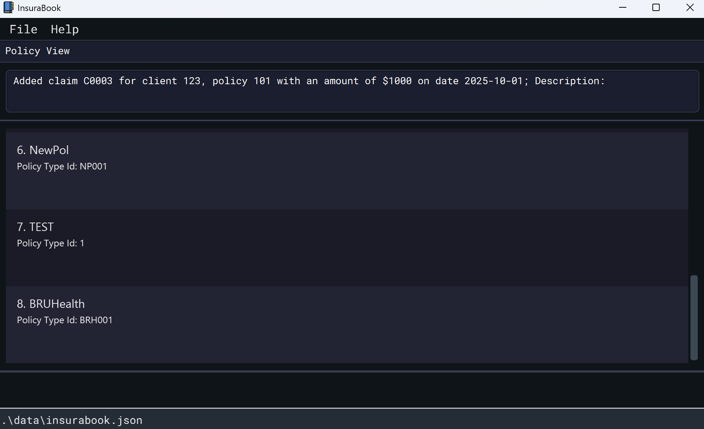
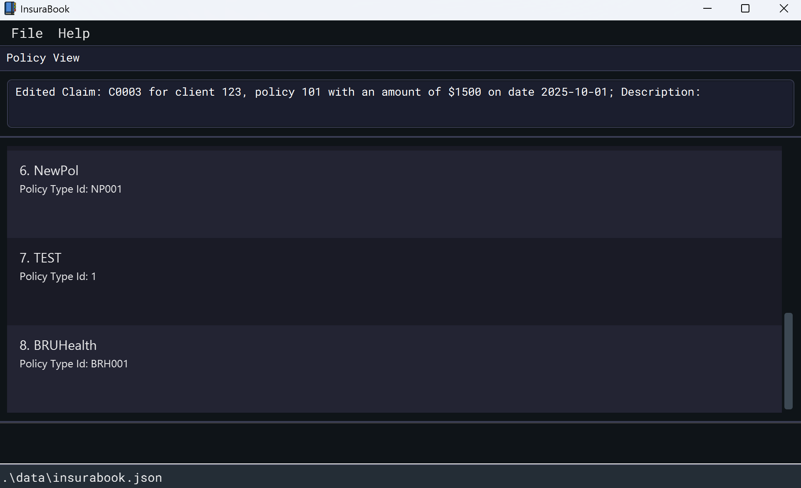
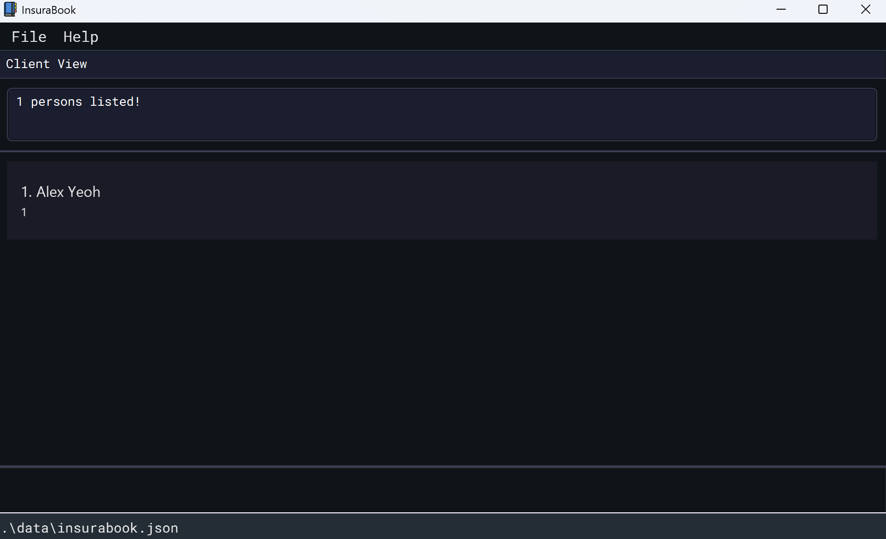
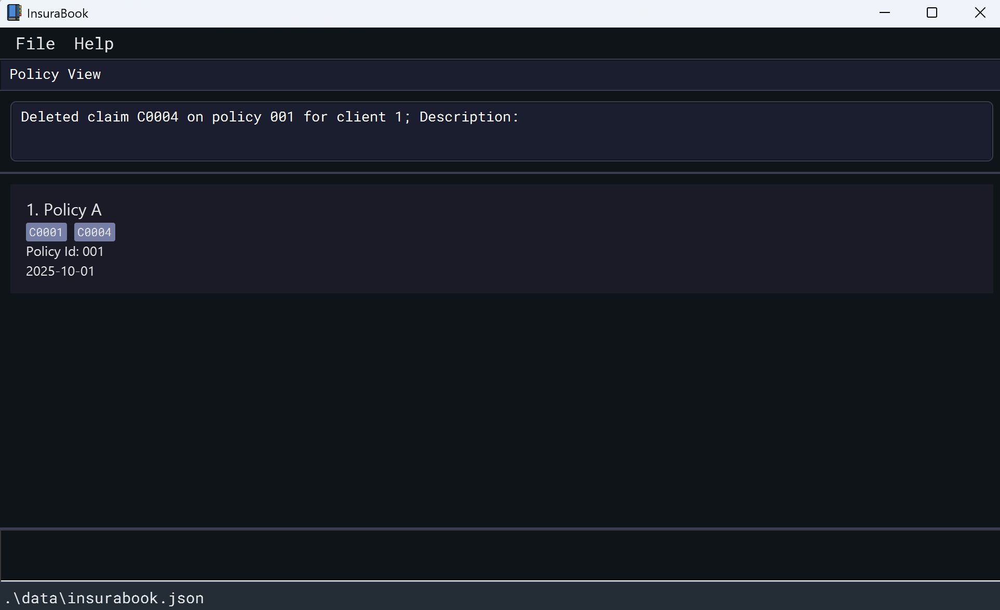

InsuraBook is a **desktop app for insurance agents managing clients' contacts**, optimized for use via a Command Line
Interface (CLI) while still having the benefits of a Graphical User Interface (GUI).
We assume you type really fast and prefer a CLI for speed, but still want a GUI to see your data. No prior programming
knowledge is needed, although you ought to be comfortable installing Java and running a `.jar` file from
a terminal.
--------------------------------------------------------------------------------------------------------------------

# Table of Contents
- [Quick Start](#quick-start)
- [Features](#features)
  - [Viewing help : `help`](#viewing-help-help)
  - [Adding a client: `add`](#adding-a-client-add)
  - [Adding a policy type: `add policy type`](#adding-a-policy-type-add-policy-type)
  - [Adding a policy to client: `add policy`](#adding-a-policy-to-client-add-policy)
  - [Adding a claim: `add claim`](#adding-a-claim-add-claim)
  - [Listing all clients: `list`](#listing-all-clients-list)
  - [Editing a policy type: `edit policy type`](#editing-a-policy-type-edit-policy-type)
  - [Editing a claim: `edit claim`](#editing-a-claim-edit-claim)
  - [Locating clients by name or ID: `find`](#locating-clients-by-name-or-id-find)
  - [Deleting a client: `delete`](#deleting-a-client-delete)
  - [Deleting a policy type: `delete policy type`](#deleting-a-policy-type-delete-policy-type)
  - [Deleting a policy from a client: `delete policy`](#deleting-a-policy-from-a-client-delete-policy)
  - [Deleting a claim: `delete claim`](#deleting-a-claim-delete-claim)
  - [Changing UI view: `view`](#changing-ui-view-view)
  - [Clearing all entries: `clear`](#clearing-all-entries-clear)
  - [Exiting the program: `exit`](#exiting-the-program-exit)
  - [Saving the data](#saving-the-data)
  - [Editing the data file](#editing-the-data-file)
- [Archiving data files `[coming in v2.0]`](#archiving-data-files-coming-in-v20)
- [FAQ](#faq)
- [Known issues](#known-issues)
- [Command summary](#command-summary)

--------------------------------------------------------------------------------------------------------------------

## Quick start

1. Ensure you have Java `17` or above installed in your Computer.
   **Mac users:** Ensure you have the precise JDK version prescribed [here](https://se-education.org/guides/tutorials/javaInstallationMac.html).

2. Download the latest `.jar` file from [here](https://github.com/se-edu/addressbook-level3/releases).

3. Copy the file to the folder you want to use as the _home folder_ for your InsuraBook.

4. In the same folder, right-click on an empty space and select `Open in Terminal`.

5. Then type the `java -jar insurabook.jar` command in the terminal to run the application.
   A GUI similar to the below should appear in a few seconds. Note how the app contains some sample data.

6. Try typing the command in the command box and press Enter to execute it.
   e.g. typing **`help`** and pressing Enter will open the help window.
   Some example commands you can try:

    * `list` : Lists all clients.
    * `add -c_id 123 -n John Doe` : Adds a client named John Doe with client id 123.
    * `delete -c_id 123` : Deletes client with client id 123 from InsuraBook.
    * `view -policy` : Lists all policy types that the insurance company sells.
    * `clear` : Deletes all clients.
    * `exit` : Exits the app.

7. Refer to the [Features](#features) below for details of each command.

---

## Features

**ℹ️ Notes about the command format:** 

* Words in `UPPER_CASE` are the parameters to be supplied by you. 
  e.g. in `add -n NAME -b BIRTHDATE -c_id CLIENT_ID`, `NAME`, `BIRTHDATE`, `CLIENT_ID` are parameters which can be used
as `add -n John Doe -b 2002-01-01 -c_id C1`.

* Items in square brackets are optional. 
  e.g. `-c_id CLIENT_ID [-desc DESC]` can be used as `-c_id 123 -desc Car Accident` or as `-c_id 123`.

* Parameters can be in any order. 
  e.g. if the command specifies `-n NAME -c_id CLIENT_ID`, `-c_id CLIENT_ID -n NAME` is also acceptable.

* Extraneous parameters for commands that do not take in parameters (such as `help`, `list`, `exit` and `clear`) will
be ignored. 
  e.g. if the command specifies `help 123`, it will be interpreted as `help`.

* If you are using a PDF version of this document, be careful when copying and pasting commands that span multiple lines
as space characters surrounding line-breaks may be omitted when copied over to the application.

---

### Viewing help : `help`

Shows a message explaining how to access the help page.  
If you ever feel stuck or forget a command, just type `help`. This will open a window with a link to all the commands
and instructions you need.

Format: `help`

---

### Adding a client: `add`

Adds a client to InsuraBook. Use this command when you sign a new client and need to create their initial record. This
is the first step to tracking all their contact information and policies in InsuraBook.

Format: `add -n NAME -b BIRTHDATE -c_id CLIENT_ID`

Examples:
* `add -n John Doe -b 2002-01-01 -c_id 123` adds a client name `John Doe` with birthdate `2002-01-01` and client ID
`123`.

* `add -n Betty Cheng -b 2000-01-01 -c_id C1` adds a client name `Betty Cheng` with client ID `C1`.

---

### Adding a policy type: `add policy type`

Adds a new policy type to InsuraBook. Before you can assign policies to clients, define the available policy
“products.” Use this command to add a new "product" (eg. "BRUHealth") to your system's catalog.

Format:  
`add policy type -pt_n POLICY_TYPE_NAME -pt_id POLICY_TYPE_ID [-ddesc DESCRIPTION] [-pr PREMIUM]`

Examples:
* `add policy type -pt_n BRUHealth -pt_id BRH001` adds a policy type named `BRUHealth` with policy type ID `BRH001`.
To view this, use the `view -policy` command.

* `add policy type -pt_n BRUWealth -pt_id BRW001 -desc Holistic savings plan -pr 1000` adds a policy type named `BRUWealth`
with policy type ID `BRW001`, optional description `Holistic savings plan`, and optional premium amount `1000`.

---

### Adding a policy to client: `add policy`

Adds a policy with expiry date to a client. When a client purchases one of your products, use this command to create
that policy (with its ID and expiry date) and link it directly to their client record.

Format:
`add policy -p_id POLICY_ID -c_id CLIENT_ID -pt_id POLICY_TYPE_ID -exp EXPIRY_DATE`

Examples:
* `add policy -p_id 101 -c_id 123 -pt_id P02 -exp 2025-10-01` adds a policy with policy ID `101`, of policy type ID
`P02`, with expiry date `2025-10-01` to the client with client ID `123`.

---

### Adding a claim: `add claim`

Adds a claim to a policy of a client. When a client purchases one of your products, use this command to create that
policy (with its ID and expiry date) and link it directly to their client record.

Format:  
`add claim -c_id CLIENT_ID -p_id POLICY_ID -amt CLAIM_AMOUNT -date CLAIM_DATE [-desc DESCRIPTION]`

Examples:
* `add claim -c_id 123 -p_id 101 -amt 1000 -date 2025-10-01` adds a claim with amount `1000` and date `2025-10-01` to
the policy with policy ID `101` for the client with client ID `123`.
* `add claim -c_id 123 -p_id 101 -amt 1000 -date 2025-10-01 -desc Car accident` adds a claim with amount `1000`,
date `2025-10-01` and optional description `Car accident` to the policy with policy ID `101` for the client with
client ID `123`.

---

### Listing all clients: `list`

Shows a list of all clients in the InsuraBook. This is your main "view all" command. Use it any time you need to see
a complete list of all clients currently stored in InsuraBook.

Format: `list`

---

### Editing a policy type: `edit policy type`

Edits an existing policy type in InsuraBook, in case of any wrong input. If you need to correct the name, premium, or
description of a previously entered policy type, use `edit policy type`.

Format:
`edit policy type -pt_id POLICY_TYPE_ID [-pt_n POLICY_TYPE_NAME] [-desc DESCRIPTION] [-pr PREMIUM]`

Examples:
* `edit policy type -pt_id BRH001 -pt_n BRUHealthExtra` edits the policy type
  name to be `BRUHealthExtra` for the policy type `BRH001`.

* `edit policy type -pt_id BRH001 -pr 1000` edits the policy type premium
  to be `1000` for the policy type `BRH001`.

---

### Editing a claim: `edit claim`

Edits an existing claim in InsuraBook, in case of any wrong input. If you need to correct the amount, date, or
description of a previously entered claim, use `edit claim`.

Format:  
`edit claim -c_id CLIENT_ID -p_id POLICY_ID -cl_id CLAIM_ID [-amt CLAIM_AMOUNT] [-date CLAIM_DATE] [-desc DESCRIPTION]`

Examples:
* `edit claim -c_id 123 -p_id 101 -cl_id C0001 -amt 1500` edits the claim
amount to be `1500` for the claim `C0001` under policy id `101` with client id `123`.

* `edit claim -c_id 123 -p_id 101 -cl_id C0001 -desc Heart surgery` edits the description to be `Heart surgery` for the
claim `C0001` under policy id `101` with client id `123`.

---

### Locating clients by name or ID: `find`

Finds clients whose names or IDs match the given keywords.

Format:  
`find FLAG [KEYWORDS_RELATING_TO_FLAG]`

* `KEYWORDS_RELATING_TO_FLAG` refers to part of a name if `FLAG` is `-n`. e.g. `Alex`, `tan`, `Shi`, `Chang`.
* `KEYWORDS_RELATING_TO_FLAG` refers to part of a client ID if `FLAG` is `-c_id`. e.g. `123`, `C0`, `a1b2c3`.

Searching for clients by name:
* The search is case-insensitive. e.g `alex` will match `Alex`
* The order of the keywords does not matter. e.g. `Yeoh Alex` will match `Alex Yeoh`
* Only the name is searched.
* Only full words will be matched e.g. `Ale` will not match `Alex`.
* Persons matching at least one keyword will be returned (i.e. OR search). e.g. `Alex Yu` will return `Alex Yeoh`,
`Bernice Yu`.
* If there are no such keywords found, an empty list of clients will be shown.

Searching for clients by client ID:
* CLIENT_IDs are alphanumerical.
* You may search for more than one client ID per find command. E.g. searching for client id `123` `345` will return 2
clients: client A with client ID `123` and client B with client ID `345`
* If there are no such IDs found, an empty list of clients will be shown.

Examples:
* `find -n John` returns `john` and `John Doe`.
* `find -n alex YU` return `Alex Yeoh`, `Bernice Yu`.

* `find -c_id 1` returns `Alex Yeoh` as his client ID is `1`.

---

### Deleting a client: `delete`

Deletes the specified client from InsuraBook. To permanently remove a client and all their associated data from
InsuraBook, use this command.

Format: `delete -c_id CLIENT_ID`

⚠ Action is **irreversible.**

Examples:
* `delete -c_id 123` deletes the client from InsuraBook with client ID `123`.

* `delete -c_id C01` deletes the client from InsuraBook with client ID `C01`.

---

### Deleting a policy type: `delete policy type`

Deletes a policy type from InsuraBook. To remove a policy type (product) from your catalog, use this command.

Format:
`delete policy type -pt_n POLICY_TYPE_NAME -pt_id POLICY_TYPE_ID`

⚠ Action is **irreversible.**

Example:
* `delete policy type -pt_n BRUHealth -pt_id BRH001`

---

### Deleting a policy from a client: `delete policy`

Deletes the specified policy previously saved under a client.

Format:
`delete policy -c_id CLIENT_ID -p_id POLICY_ID`

⚠ Action is **irreversible.**

Example:
* `view -c_id 1` to look for client with client id `1` and all the policies the client owns, followed by
`delete -c_id 1 -p_id 002` deletes policy with policy id 002 from the client's portfolio.

---

### Deleting a claim: `delete claim`

Deletes the specified claim from the InsuraBook. To permanently remove a claim from a policy under a client, use this
command.

Format:
`delete claim -c_id CLIENT_ID -p_id POLICY_ID -cl_id CLAIM_ID [-desc DESCRIPTION]`

💡 **Tip:** Since you are intending to remove a claim, specifying the description is not necessary. 
⚠ Action is **irreversible.**

Example:
* `view -c_id 1` to look for client with client id `1` and all the policies the client owns, followed by
`delete claim -c_id 1 -p_id 001 -cl_id C0004` deletes the client's claim with claim id `C0004` under policy id `001`.

---

### Changing UI View: `view`

Changes the view of the user interface. You may switch between 1 of 3 views. The view command lets you switch the main
window's display to show either all clients, all policy types, or all policies for a single client

Format:
`view FLAG [CLIENT_ID]`
* Shows a list of all existing records inside InsuraBook.
* FLAG is used to tell the program what view to choose.
* The default view of the UI will be the client view.
* CLIENT_ID is only used when retrieving the view to display all policies a certain client has bought.

Examples:
* `view -client` changes the view to list out all clients recorded in InsuraBook.

* `view -policy` changes the view to list out all policy types available that are sold or offered by the company.

* `view -c_id 123` changes the view to list out all policies bought by client with clident ID `1`.

---

### Clearing all entries: `clear`

Clears **ALL** entries from InsuraBook.

Format: `clear`

⚠ Action is **irreversible.**

---

### Exiting the program: `exit`

Exits the program.

Format: `exit`

---

### Saving the data

InsuraBook data is saved automatically to disk after any command that changes the data.  
No manual saving is required.

---

### Editing the data file

Data are stored as a JSON file at `[JAR file location]/data/insurabook.json`.
Advanced users may edit it directly, but:

⚠️ **Caution:**
If your changes make the file invalid, InsuraBook will discard all data and start with an empty file.
Backup before editing. Certain edits can cause unexpected behavior.

---

### Archiving data files `[coming in v2.0]`

_Details coming soon ..._

--------------------------------------------------------------------------------------------------------------------

## FAQ

**Q**: How do I transfer my data to another Computer?
**A**: Install the app on the other computer and overwrite its data file with the one from your InsuraBook home folder.

--------------------------------------------------------------------------------------------------------------------

## Known issues

1. **Multiple screens:** Moving the app to a secondary screen and later using only one may cause the GUI to open
off-screen.
   **Fix:** Delete `preferences.json` before running again.

2. **Help window minimized:** If minimized, subsequent `help` commands will not open a new window.
   **Fix:** Restore the minimized window manually.

--------------------------------------------------------------------------------------------------------------------

## Command summary

Action | Format                                                                                                                  | Examples
---|-------------------------------------------------------------------------------------------------------------------------|---
**Add Client** | `add -n NAME -c_id CLIENT_ID`                                                                                           | `add -n John Doe -c_id 123`
**Add Policy Type** | `add policy type -pt_n POLICY_TYPE_NAME -pt_id POLICY_TYPE_ID [-d DESCRIPTION] [-pr PREMIUM]`                           | `add policy type -pt BRUWealth -pt_id BRW001 -d Holistic savings plan -pr 1000`
**Add Policy** | `add policy -p_id POLICY_ID -c_id CLIENT_ID -pt_id POLICY_TYPE_ID -exp EXPIRY_DATE`                                     | `add policy -p_id 101 -c_id 123 -pt_id P02 -exp 2025-10-01`
**Add Claim** | `add claim -c_id CLIENT_ID -p_id POLICY_ID -amt CLAIM_AMOUNT -date CLAIM_DATE [-desc DESCRIPTION]`                      | `add claim -c_id 123 -p_id 101 -amt 1000 -date 2025-10-01 -desc Car accident`
**Clear** | `clear`                                                                                                                 | `clear`
**Delete Client** | `delete -c_id CLIENT_ID`                                                                                                | `delete -c_id 123`
**Delete Policy Type** | `delete policy type -pt_n POLICY_TYPE_NAME -pt_id POLICY_TYPE_ID`                                                       | `delete policy type -pt BRUWealth -pt_id BRW001`
**Delete Policy** | `delete policy -c_id CLIENT_ID -p_id POLICY_ID`                                                                         | `delete -c_id 123 -p_id 101`
**Delete Claim** | `delete claim -c_id CLIENT_ID -p_id POLICY_ID -cl_id CLAIM_ID`                                                          | `delete -c_id 123 -p_id 101 -cl_id C001`
**Edit Claim** | `edit claim -c_id CLIENT_ID -p_id POLICY_ID -cl_id CLAIM_ID [-amt CLAIM_AMOUNT] [-date CLAIM_DATE] [-desc DESCRIPTION]` | `edit claim -c_id 123 -p_id 101 -cl_id C0001 -amt 1500 -desc Heart surgery`
**Find** | `find FLAG [KEYWORDS_RELATING_TO_FLAG]`                                                                                 | `find -n John`
**View** | `view FLAG [CLIENT_ID]`                                                                                                 | `view -policy`, `view -client`, `view -c_id 123`
**List** | `list`                                                                                                                  | `list`
**Help** | `help`                                                                                                                  | `help`
**Exit** | `exit`                                                                                                                  | `exit`
