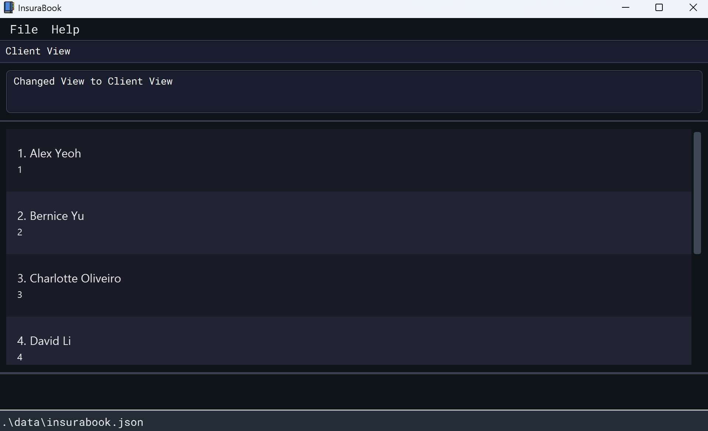

InsuraBook is a **desktop app for insurance agents managing clients' contacts**.
We assume you type really fast, but still want a nice display to see your data. No prior programming
knowledge is needed, although you ought to be comfortable installing Java and running a `.jar` file from
a terminal.

---

# Table of Contents
- [Quick Start](#quick-start)
- [Constraints](#constraints)
- [Features](#features)
- [Command Summary](#command-summary)
- [Viewing help : `help`](#viewing-help--help)
- [Adding a client: `add`](#adding-a-client-add)
- [Adding a policy type: `add policy type`](#adding-a-policy-type-add-policy-type)
- [Adding a policy to client: `add policy`](#adding-a-policy-to-client-add-policy)
- [Adding a claim: `add claim`](#adding-a-claim-add-claim)
- [Listing all clients: `list`](#listing-all-clients-list)
- [Editing a client's details: `edit`](#editing-a-client-edit)
- [Editing a policy type: `edit policy type`](#editing-a-policy-type-edit-policy-type)
- [Editing a policy: `edit policy`](#editing-a-policy-edit-policy)
- [Editing a claim: `edit claim`](#editing-a-claim-edit-claim)
- [Locating clients: `find`](#locating-clients-find)
- [Deleting a client: `delete`](#deleting-a-client-delete)
- [Deleting a policy type: `delete policy type`](#deleting-a-policy-type-delete-policy-type)
- [Deleting a policy from a client: `delete policy`](#deleting-a-policy-from-a-client-delete-policy)
- [Deleting a claim: `delete claim`](#deleting-a-claim-delete-claim)
- [Changing UI view: `view`](#changing-ui-view-view)
- [Undo a previous change: `undo`](#undo-a-previous-change-undo)
- [Clearing all entries: `clear`](#clearing-all-entries-clear)
- [Exiting the program: `exit`](#exiting-the-program-exit)
- [Startup Summary & Alerts](#startup-summary--alerts)
- [Saving the data](#saving-the-data)
- [Editing the data file](#editing-the-data-file)
- [FAQ](#faq)
- [Known issues](#known-issues)

---

## Quick start

1. Ensure you have Java `17` or above installed in your Computer.
> **Mac users:** Ensure you have the precise JDK version prescribed [here](https://se-education.org/guides/tutorials/javaInstallationMac.html).

2. Download the latest `.jar` file from [here](https://github.com/AY2526S1-CS2103T-F15b-1/tp/releases).

3. Copy the file to a folder you want to use as the _home folder_ for your InsuraBook.

4. In the same folder, right-click on an empty space and select `Open in Terminal`.

5. Then type the `java -jar insurabook.jar` command in the terminal to run the application.
   A GUI similar to the below should appear in a few seconds. Note how the app contains some sample data.
    <p align="center">
        
    </p>

6. Try typing the command in the command box and press Enter to execute it.
   e.g. typing **`help`** and pressing Enter will open the help window.
   Some example commands you can try:

    * `list` : Lists all clients.
    * `add -n John Doe -phone 90000001 -email johndoe@example.com -b 2001-01-01 -c_id 123` : Adds a client named `John
Doe` with client id `123`, birthday on `01 Jan 2001`, phone number `90000001` and email address `johndoe@example.com`.
    * `delete -c_id 123` : Deletes client with client id 123 from InsuraBook.
    * `view -policy` : Lists all policy types that the insurance company sells.
    * `clear` : Deletes all clients.
    * `exit` : Exits the app.

7. Refer to the [Features](#features) below for details of each command.

---

## Constraints

* An Identifier is treated as unique.<br>
    1. Two clients cannot have the same `CLIENT_ID`. If they have the same name, they are treated as different clients.
    2. Two policy types cannot have the same `POLICY_TYPE_ID`.
    3. Two policies cannot have the same `POLICY_ID` or `POLICY_TYPE_ID` under the same client.
    4. Two claims cannot have the same `CLAIM_ID` under the same policy of the same client.

## Features

<div markdown="block" class="alert alert-info">

**:information_source: Notes about the command format:**<br>

* Words in `UPPER_CASE` are the parameters to be supplied by you.<br>
  e.g. in `add -n NAME -phone PHONE_NUMBER -email EMAIL -b BIRTHDATE -c_id CLIENT_ID`, `NAME`, `PHONE_NUMBER`, `EMAIL`, `BIRTHDATE`, `CLIENT_ID` are parameters which can be used
as `add -n John Doe -phone 98765432 -email johndoe@example.com -b 2002-01-01 -c_id C101`.

* Items in square brackets are optional.<br>
  e.g. `add claim -c_id CLIENT_ID -p_id POLICY_ID -amt AMOUNT -date CLAIM_DATE [-desc DESC]` can be used as `add claim -c_id C101 -p_id 101 -amt 1000 -date 2025-10-01 -desc Car Accident` or as `add claim -c_id C101 -p_id 101 -amt 1000 -date 2025-10-01`.
    > :bulb: Make sure client C101 and policy 101 already exist before executing this command.

* Parameters can be in any order.<br>
  e.g. if the command specifies `-n NAME -c_id CLIENT_ID`, `-c_id CLIENT_ID -n NAME` is also acceptable.

* Note that for edit commands (`edit`, `edit policy type`, `edit policy`, `edit claim`), IDs are not meant to be edited,
as they are unique identifiers. Provide IDs to identify the record to be edited, and provide new values for other fields to update them.

* If you are using a PDF version of this document, be careful when copying and pasting commands that span multiple lines
as space characters surrounding line-breaks may be omitted when copied over to the application.
</div>

---

## Command Summary
<small>[(back to Contents)](#table-of-contents)</small>

Action | Format                                                                                                                  | Examples
---|-------------------------------------------------------------------------------------------------------------------------|---
**Add Client** | `add -n NAME -phone PHONE_NUMBER -email EMAIL -b BIRTHDAY -c_id CLIENT_ID`                                              | `add -n John Doe -phone 90000001 -email johndoe@example.com -b 2001-01-01 -c_id 123`
**Add Policy Type** | `add policy type -pt_n POLICY_TYPE_NAME -pt_id POLICY_TYPE_ID [-d DESCRIPTION] [-pr PREMIUM]`                           | `add policy type -pt BRUWealth -pt_id BRW001 -d Holistic savings plan -pr 1000`
**Add Policy** | `add policy -p_id POLICY_ID -c_id CLIENT_ID -pt_id POLICY_TYPE_ID -exp EXPIRY_DATE`                                     | `add policy -p_id 101 -c_id 123 -pt_id P02 -exp 2025-10-01`
**Add Claim** | `add claim -c_id CLIENT_ID -p_id POLICY_ID -amt CLAIM_AMOUNT -date CLAIM_DATE [-desc DESCRIPTION]`                      | `add claim -c_id 123 -p_id 101 -amt 1000 -date 2025-10-01 -desc Car accident`
**Clear** | `clear`                                                                                                                 | `clear`
**Delete Client** | `delete -c_id CLIENT_ID`                                                                                                | `delete -c_id 123`
**Delete Policy Type** | `delete policy type -pt_n POLICY_TYPE_NAME -pt_id POLICY_TYPE_ID`                                                       | `delete policy type -pt BRUWealth -pt_id BRW001`
**Delete Policy** | `delete policy -c_id CLIENT_ID -p_id POLICY_ID`                                                                         | `delete -c_id 123 -p_id 101`
**Delete Claim** | `delete claim -c_id CLIENT_ID -p_id POLICY_ID -cl_id CLAIM_ID`                                                          | `delete -c_id 123 -p_id 101 -cl_id C001`
**Edit Client Name** | `edit -c_id CLIENT_ID -n NEW_NAME`                                                                                      | `edit -c_id 123 -n John Doe 2`
**Edit Client Phone** | `edit -c_id CLIENT_ID -phone NEW_PHONE_NUMBER`                                                                          | `edit -c_id 123 -phone 99900001`
**Edit Client Email** | `edit -c_id CLIENT_ID -email NEW_EMAIL`                                                                                 | `edit -c_id 123 -email johndoe2@example.com`
**Edit Policy Type** | `edit policy type -pt_id POLICY_TYPE_ID [-pt_n POLICY_TYPE_NAME] [-desc DESCRIPTION] [-pr PREMIUM]`                     | `edit policy type -pt_id BRH001 -pt_n BRUHealthExtra -pr 1000`
**Edit Policy** | `edit policy -c_id CLIENT_ID -p_id POLICY_ID [-exp EXPIRY_DATE]`                                                        | `edit policy -c_id 123 -p_id 101 -exp 2026-12-31`
**Edit Claim** | `edit claim -c_id CLIENT_ID -p_id POLICY_ID -cl_id CLAIM_ID [-amt CLAIM_AMOUNT] [-date CLAIM_DATE] [-desc DESCRIPTION]` | `edit claim -c_id 123 -p_id 101 -cl_id C0001 -amt 1500 -desc Heart surgery`
**Find** | `find FLAG [KEYWORDS_RELATING_TO_FLAG]`                                                                                 | `find -n John` , `find -c_id 123 345`
**View** | `view FLAG [CLIENT_ID]`                                                                                                 | `view -policy`, `view -client`, `view -c_id 123`
**List** | `list`                                                                                                                  | `list`
**Undo** | `undo`                                                                                                                  | `undo`
**Help** | `help`                                                                                                                  | `help`
**Exit** | `exit`                                                                                                                  | `exit`

---

### Viewing help : `help`
<small>[(back to Contents)](#table-of-contents)</small>

Shows a message explaining how to access the help page.

If you ever feel stuck or forget a command, just type `help`. This will open a window with a link to all the commands
and instructions you need.

Format: `help`

<p align="center">
    
</p>

---

### Adding a client: `add`
<small>[(back to Contents)](#table-of-contents)</small>

Adds a client to InsuraBook. Use this command when you sign a new client and need to create their initial record. This
is the first step to tracking all their contact information and policies in InsuraBook.

Format: `add -n NAME -phone PHONE_NUMBER -email EMAIL -b BIRTHDATE -c_id CLIENT_ID`

Examples:
* `add -n John Doe -phone 90000001 -email johndoe@example.com -b 2002-01-01 -c_id 123` adds a client name `John Doe`
with phone number `90000001`, email `johndoe@example.com`, birthdate `2002-01-01` and client ID `123`.

Parameters:
* Client Name: Only alphanumeric characters and spaces, cannot be blank.
* Phone Number: Only numbers, at least 3 digits long.
* Email: In the format "local-part@domain". More details are specified in the error message.
* Birthday: In the format "YYYY-MM-DD".
* Client ID: Only alphanumeric characters and spaces, cannot be blank.

<p align="center">
    
</p>

* `add -n Betty Cheng -phone 99900001 -email bettycheng@example.com -b 2000-01-01 -c_id C1`
adds a client name `Betty Cheng` with client ID `C1`.
* performing another `add -n Betty Cheng -phone 99900001 -email bettycheng@example.com -b 2000-01-01 -c_id C1` will
result in `duplicate client` error because client ID `C1` already exists, not because client has same name.

---

### Adding a policy type: `add policy type`
<small>[(back to Contents)](#table-of-contents)</small>

Adds a new policy type to InsuraBook. Before you can assign policies to clients, define the available policy
“products.” Use this command to add a new "product" (eg. "BRUHealth") to your system's catalog.

Format:
`add policy type -pt_n POLICY_TYPE_NAME -pt_id POLICY_TYPE_ID [-desc DESCRIPTION] [-pr PREMIUM]`

Parameters:
* Name of policy type: Only ASCII characters, cannot start with '-' and cannot be blank.
* Policy Type ID: Only alphanumeric characters or '-', cannot start with '-' and cannot be blank.
* Description: Only ASCII characters, cannot start with '-' and cannot be blank.
* Starting Premium: A positive integer or floating point number.

Examples:
* `add policy type -pt_n BRUHealth -pt_id BRH001` adds a policy type named `BRUHealth` with policy type ID `BRH001`.

<p align="center">
    
</p>

* To view this, use the `view -policy` command.

<p align="center">
    
</p>

* `add policy type -pt_n BRUWealth -pt_id BRW001 -desc Holistic savings plan -pr 1000` adds a policy type named `BRUWealth`
with policy type ID `BRW001`, optional description `Holistic savings plan`, and optional premium amount `1000`.

---

### Adding a policy to client: `add policy`
<small>[(back to Contents)](#table-of-contents)</small>

Adds a policy with expiry date to a client. When a client purchases one of your products, use this command to create
that policy (with its ID and expiry date) and link it directly to their client record.

Format:
`add policy -p_id POLICY_ID -c_id CLIENT_ID -pt_id POLICY_TYPE_ID -exp EXPIRY_DATE`

<div markdown="span" class="alert alert-warning">
<span style="color:orange">⚠️ **Warnings:**</span>
Ensure that the client and policy type already exist in InsuraBook before adding a policy.
</div>

Parameters:
* Policy ID: Only alphanumeric characters, cannot be blank.
* Client ID: Must be of an existing client.
* Policy Type ID: Must be of an existing policy type.
* Expiry Date: In the format "YYYY-MM-DD", must be in the future.

Examples:
* `add policy -p_id 101 -c_id 123 -pt_id P03 -exp 2025-12-01` adds a policy with policy ID `101`, of policy type ID
`P03`, with expiry date `2025-12-01` to the client with client ID `123`.

<p align="center">
    
</p>

* To view this, use the `view -c_id 123` command to view the newly added policy.

<p align="center">
    
</p>

> :bulb: **Quick Tip:** Not sure of the policy type ID or client ID? Use the `view -client` or `view -policy` commands to
> find them
before adding a policy.

---

### Adding a claim: `add claim`
<small>[(back to Contents)](#table-of-contents)</small>

Adds a new claim record to an existing policy for a specific client. 

When one of your clients files a claim against their policy, use this command to log the claim details
(amount, date, and optional description) under the appropriate policy in their client record.

Format:
`add claim -c_id CLIENT_ID -p_id POLICY_ID -amt CLAIM_AMOUNT -date CLAIM_DATE [-desc DESCRIPTION]`

<div markdown="span" class="alert alert-warning">
<span style="color:orange">⚠️ **Warnings:**</span>
Ensure that the client and policy already exist in InsuraBook before adding a claim. Also, claim date must not be
later than the policy's expiry date.
</div>

Parameters:
* Client ID: ID of an existing client. Only alphanumeric characters.
* Policy ID: ID of an existing policy under the specified client. Only alphanumeric characters.
* Claim Amount: Amount claimed by client in Singapore dollar. Must be a positive number, with up to two decimal places.
* Claim Date: Date on which the claim is made in the format "YYYY-MM-DD".
* Description: A message describing the claim.

Examples:
* To add a claim with no description:
    ```
    add claim -c_id 123 -p_id 101 -amt 1000 -date 2025-12-01
    ```
    This adds a claim with amount $1000 on date 2025-12-01 to policy 101 for client 123.
    
    To view the newly added claim:
    ```
    view -c_id 123
    ```
  This displays all policies and claims for client 123, including the newly added claim.

<p align="center">
    
</p>

* To add a claim with a description:
    ```
    add claim -c_id 123 -p_id 101 -amt 2000 -date 2025-11-01 -desc Car accident
    ```
    This adds the same claim but includes the description "Car Accident".

> :bulb: **Quick Tip:** Not sure of the policy ID or client ID? Use the `view -client` or `view -c_id CLIENT_ID` commands to find
> them before adding a claim.

---

### Listing all clients: `list`
<small>[(back to Contents)](#table-of-contents)</small>

Shows a list of all clients in the InsuraBook. This is your main "view all" command. Use it any time you need to see
a complete list of all clients currently stored in InsuraBook.

Format: `list`

<p align="center">
    
</p>

---

### Editing a client: `edit`
<small>[(back to Contents)](#table-of-contents)</small>

Allows you to edit a client's
- name
- phone number
- email
- birthday

<span style="color:orange">⚠ Client ID is unique, and cannot be edited.</span>

Parameter requirements are identical to [add](#adding-a-client-add).

Format:
- `edit -c_id CLIENT_ID -n NEW_NAME`
- `edit -c_id CLIENT_ID -phone NEW_PHONE_NUMBER`
- `edit -c_id CLIENT_ID -email NEW_EMAIL`
- `edit -c_id CLIENT_ID -b NEW_BIRTHDAY`

Users can edit multiple tags in a single command, such as:
`edit -c_id CLIENT_ID -n NEW_NAME -email NEW_EMAIL`

Editing multiple details:
<p align="center">
    
</p>

Phone and email are updated.
<p align="center">
    
</p>

---

### Editing a policy type: `edit policy type`
<small>[(back to Contents)](#table-of-contents)</small>

Edits an existing policy type in InsuraBook, in case of any wrong input. If you need to correct the name, premium, or
description of a previously entered policy type, use `edit policy type`.

Format:
`edit policy type -pt_id POLICY_TYPE_ID [-pt_n POLICY_TYPE_NAME] [-desc DESCRIPTION] [-pr PREMIUM]`

Parameter requirements are identical to [add policy type](#adding-a-policy-type-add-policy-type).

Examples:
* `edit policy type -pt_id BRH001 -pt_n BRUHealthExtra` edits the policy type
  name to be `BRUHealthExtra` for the policy type `BRH001`.

<p align="center">
    
</p>

* `edit policy type -pt_id BRH001 -pr 1000` edits the policy type premium
  to be `1000` for the policy type `BRH001`.

---

### Editing a policy: `edit policy`
<small>[(back to Contents)](#table-of-contents)</small>

Updates the details of an existing policy attached to a client. Use this command if you need to correct the expiry date
of a previously filed policy.

Format:
`edit policy -c_id CLIENT_ID -p_id POLICY_ID [-exp EXPIRY_DATE]`

Parameter requirements are identical to [add policy](#adding-a-policy-to-client-add-policy).

Examples:
* `edit policy -c_id C101 -p_id P101 -exp 2026-12-31` edits **only** the expiry date to `2026-12-31` for policy `P101`
under client `C101`.

---

### Editing a claim: `edit claim`
<small>[(back to Contents)](#table-of-contents)</small>

Updates the details of an existing claim. 

Made a typo? Or maybe the claim's details changed? No worries, as you can easily update the claim's amount, date, or
description using this command on any existing claim.

Format:
`edit claim -c_id CLIENT_ID -p_id POLICY_ID -cl_id CLAIM_ID [-amt CLAIM_AMOUNT] [-date CLAIM_DATE] [-desc DESCRIPTION]`

Parameter requirements are identical to [add claim](#adding-a-claim-add-claim).

Examples:
* To edit **only** the amount of a claim:
    ```
    edit claim -c_id C101 -p_id P101 -cl_id CL001 -amt 1500
    ```
  This updates the amount to $1500 for claim CL001.
* To edit **multiple fields** of a claim:
    ```
    edit claim -c_id C101 -p_id P101 -cl_id CL001 -date 2025-10-05 -desc Surgery
    ```
  This updates the date to 2025-10-05 and its description to "Surgery" for claim CL001.

---

### Locating clients: `find`
<small>[(back to Contents)](#table-of-contents)</small>

Finds clients in InsuraBook by searching for keywords related to their `Name` or `Client ID`.

The command's behavior changes depending on the flag you use ([`-n` for Name](#searching-by-clients-name--n),
[`-c_id` for Client ID](#searching-by-clients-id--c_id)).

#### Searching by client's name `-n`:

Searches for clients whose names contain at least one of the specified keywords.

Format: `find -n NAMES [MORE_NAMES]`

Rules:
* **Case-Insensitive**: Keywords are not case-sensitive. (e.g. `alex` will match `Alex`)
* **Full Words Only**: The search matches complete words. (e.g. `Ale` will not match `Alex`)
* **OR Search**: Persons matching at least one keyword will be returned. (e.g. `Alex Yu` will return `Alex Yeoh`,
  `Bernice Yu`)
* **Order Doesn't Matter**: The order of the keywords is not important. (e.g. `Yeoh Alex` will match `Alex Yeoh`)
* If there are no such keywords found, an empty list of clients will be shown.

Examples:
* `find -n John`
  * **Result**: Returns clients named `John` and `John Doe`.

<p align="center">
    
</p>

* `find -n alex YU`
  * **Result**: Returns clients named `Alex Yeoh` (who matched `alex`), and `Bernice Yu` (who matched `YU`).

<p align="center">
    
</p>

#### Searching by client's ID `-c_id`:

Searches for clients whose CLIENT_IDs match the specified IDs.

Format: `find -c_id CLIENT_IDs [MORE_CLIENT_IDs]`

Rules:
* **OR Search**: Clients matching at least one ID will be returned. (e.g. searching for client id `123` `345`
will return 2 clients: client A with client ID `123` and client B with client ID `345`)
* **Case-Insensitive**: Client IDs are alphanumerical and the search is not case-sensitive. (e.g., c012 will match C012).
* **Full IDs Only**: The search matches complete IDs. (e.g. `101` will not match `C101`)
* If there are no such IDs found, an empty list of clients will be shown.

Examples:
* `find -c_id 1`
  * **Result**: Returns client with client ID `1`.

<p align="center">
    
</p>

* `find -c_id 2 123`
  * **Result**: Returns clients with client IDs `2` and `123`.

<p align="center">
    
</p>

---

### Deleting a client: `delete`
<small>[(back to Contents)](#table-of-contents)</small>

Deletes the specified client from InsuraBook. To permanently remove a client and all their associated data from
InsuraBook, use this command.

Format: `delete -c_id CLIENT_ID`

Parameter requirements are identical to [add](#adding-a-client-add).

<span style="color:orange">⚠ Action removes data, but can be reversed with 'undo'.</span>

Examples:
* `delete -c_id 7` deletes the client from InsuraBook with client ID `7`.

<p align="center">
    
</p>

* `delete -c_id C01` deletes the client from InsuraBook with client ID `C01`.

---

### Deleting a policy type: `delete policy type`
<small>[(back to Contents)](#table-of-contents)</small>

Deletes a policy type from InsuraBook. To remove a policy type (product) from your catalog, use this command.

Format:
`delete policy type -pt_n POLICY_TYPE_NAME -pt_id POLICY_TYPE_ID`

Parameter requirements are identical to [add policy type](#adding-a-policy-type-add-policy-type).

<span style="color:orange">⚠ Action removes data, but can be reversed with 'undo'.</span>

<span style="color:red">⚠ WARNING: This will also delete any policies that have this policy type!</span>

Example:
* `delete policy type -pt_n BRUHealth -pt_id BRH001`

<p align="center">
    
</p>

---

### Deleting a policy from a client: `delete policy`
<small>[(back to Contents)](#table-of-contents)</small>

Deletes the specified policy previously saved under a client.

Format:
`delete policy -c_id CLIENT_ID -p_id POLICY_ID`

Parameter requirements are identical to [add policy](#adding-a-policy-to-client-add-policy).

<span style="color:orange">⚠ Action removes data, but can be reversed with 'undo'.</span>

Example:
* `view -c_id 3` to look for client with client id `3` and all the policies the client owns, followed by
`delete policy -c_id 3 -p_id 001` deletes policy with policy id `001` from the client's portfolio.

<p align="center">
    
</p>

---

### Deleting a claim: `delete claim`
<small>[(back to Contents)](#table-of-contents)</small>

Deletes the specified claim of a client's policy from the InsuraBook.

Format:
`delete claim -c_id CLIENT_ID -p_id POLICY_ID -cl_id CLAIM_ID [-desc DESCRIPTION]`

Parameter requirements are identical to [add claim](#adding-a-claim-add-claim).

> :bulb: **Tip:** Description is an optional field. It is just for user's reference and will not be used to identify the
> claim to delete.

Example: Let's say you need to delete claim `CL003` from policy `P101` for client `C101`.
1. **First, find the correct IDs:**
    Use `view` command to see all policies and claims for client `C101`.
    ```
    view -c_id C101
    ```
    This command will list all policies and their claims for client `C101`, allowing you to confirm that `P101` exists in client's portfolio and that `CL003` is indeed a claim under that policy.

2. **Then, execute the delete command:**
    Once you've confirmed the IDs, use the following command to delete the claim:
    ```
    delete claim -c_id C101 -p_id P101 -cl_id CL003
    ```
    This command will delete claim `CL003` from policy `P101` for client `C101`.

---

### Changing UI View: `view`
<small>[(back to Contents)](#table-of-contents)</small>

Changes the view of the user interface. You may switch between 1 of 3 views. The view command lets you switch the main
window's display to show either all clients, all policy types, or all policies for a single client

Format:
`view FLAG [CLIENT_ID]`
* Shows a list of all existing records inside InsuraBook.
* FLAG is used to tell the program what view to choose. (`-client`, `-policy` or `-c_id`)
* The default view of the UI will be the client view.
* CLIENT_ID is only used when retrieving the view to display all policies a certain client has bought.

Examples:
* `view -client` changes the view to list out all clients recorded in InsuraBook.

<p align="center">
    
</p>

* `view -policy` changes the view to list out all policy types available that are sold or offered by the company.

<p align="center">
    
</p>

* `view -c_id 123` changes the view to list out all policies bought by client with client ID `123`.

<p align="center">
    
</p>

---

### Undo a previous change: `undo`
<small>[(back to Contents)](#table-of-contents)</small>

Undo your previous change to InsuraBook

Format `undo`

Changes are:
- adding client, policies, policy types and claims
- deleting client, policies, policy types and claims
- edits to any information, e.g. name, phone, email, birthday

<span style="color:red">⚠ InsuraBook cannot undo changes from **previous saves**.</span>

Example:
* State after clearing InsuraBook with `clear`.

<p align="center">
    
</p>

* State after undoing the clear with `undo`.

<p align="center">
    
</p>

---

### Clearing all entries: `clear`
<small>[(back to Contents)](#table-of-contents)</small>

Clears **ALL** entries from InsuraBook.

Format: `clear`

<span style="color:orange">⚠ Clears all data. You can use 'undo' to recover it if needed.</span>

---

### Exiting the program: `exit`
<small>[(back to Contents)](#table-of-contents)</small>

Exits the program.

Format: `exit`

---

### Startup Summary & Alerts
<small>[(back to Contents)](#table-of-contents)</small>

To help you stay on top of your client relationships, InsuraBook automatically displays
a summary of key alerts every time you launch the application.

This summary includes:

🎂 **Today's Client Birthdays**

This list shows all clients who have their birthdays today.
* **Value:** Helps user remember to send birthday wishes, strengthening client relationships!

<p align="center">
    
</p>

**:information_source: Expiring Policies (Next 3 Days)**

This list highlights policies that are set to expire within the next three days (including today).
* **Value:** This acts as an urgent "to-do" list, ensuring you can proactively reach out to clients about renewals and
preventing lapses in coverage.

<p align="center">
    
</p>

---

### Saving the data
<small>[(back to Contents)](#table-of-contents)</small>

InsuraBook data is saved automatically to disk after any command that changes the data.
No manual saving is required.

---

### Editing the data file
<small>[(back to Contents)](#table-of-contents)</small>

Data are stored as a JSON file at `[JAR file location]/data/insurabook.json`.
Advanced users may edit it directly, but:

<div markdown="span" class="alert alert-warning">
<span style="color:orange">⚠️ **Caution:**</span>
If your changes make the file invalid, InsuraBook will backup all data separately and start with an empty file.
You are advised to perform your own backup before editing. Certain edits can cause unexpected behavior.
</div>

---

## FAQ
<small>[(back to Contents)](#table-of-contents)</small>

**Q**: How do I transfer my data to another Computer?<br>
**A**: Install the app on the other computer and overwrite its data file with the one from your InsuraBook home folder.

**Q**: If I have multiple clients with the same name, will I be able to add them into the app?<br>
**A**: Yes. Clients are identified by their unique CLIENT_ID, so you can have multiple clients with the same name. The
client ID must be unique.

---

## Known issues
<small>[(back to Contents)](#table-of-contents)</small>

1. **Multiple screens:** Moving the app to a secondary screen and later using only one may cause the GUI to open
off-screen.

   **Fix:** Delete `preferences.json` before running again.

2. **Help window minimized:** If minimized, subsequent `help` commands will not open a new window.

   **Fix:** Restore the minimized window manually.

3. **PDF Viewing issues:** PDF versions of this document may introduce formatting issues when viewing long descriptions.

   **Fix:** Visit out webpage for the properly formatted version at [User Guide](https://ay2526s1-cs2103t-f15b-1.github.io/tp/UserGuide.html).

--------------------------------------------------------------------------------------------------------------------
