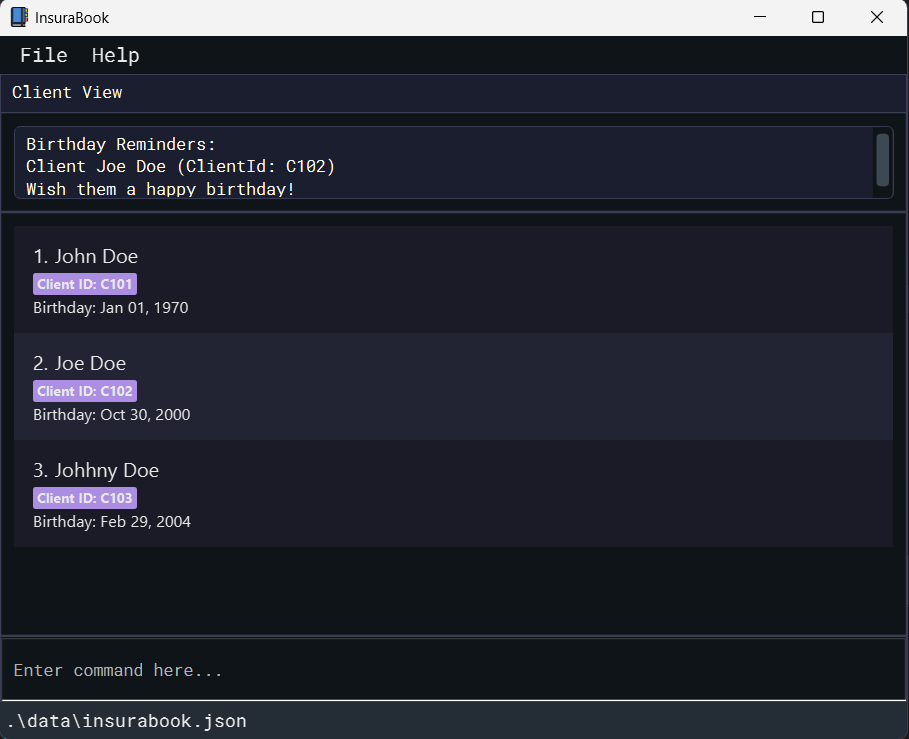

**InsuraBook is a desktop application for managing your clients and policies details.
** While it has a GUI, most of the user interactions happen using a CLI (Command Line Interface).

* If you are interested in using AddressBook, head over to the [_Quick Start_ section of the **User Guide**](UserGuide.html#quick-start).
* If you are interested about developing AddressBook, the [**Developer Guide**](DeveloperGuide.html) is a good place to start.

**Acknowledgements**

* Libraries used: [JavaFX](https://openjfx.io/), [Jackson](https://github.com/FasterXML/jackson), [JUnit5](https://github.com/junit-team/junit5)
